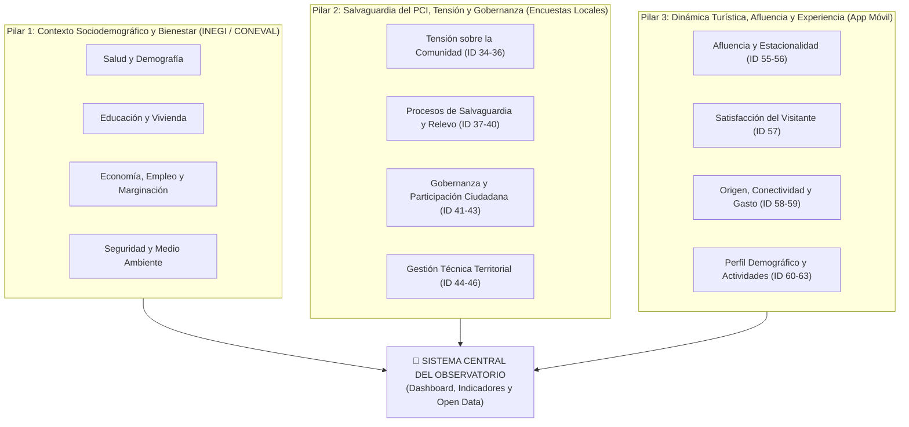
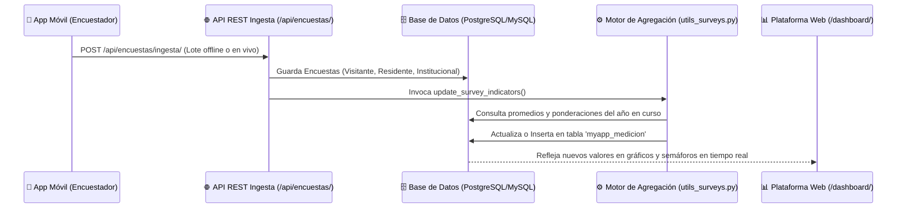

# 📚 Catálogo y Fichas Metodológicas de Indicadores
### Observatorio de Datos Turísticos, Culturales y Sociales de Huaquechula
**Municipio:** Huaquechula, Puebla, México  
**Plataforma Tecnológica:** Observatorio Web & App Móvil Offline Resiliente  
**Versión del Catálogo:** 1.0 (Oficial)  
**Marco de Referencia:** UNESCO (Salvaguardia del PCI), OMT (Turismo Sostenible) e INEGI  

---

## 📌 1. Marco Metodológico y Conceptual

El **Observatorio de Datos de Huaquechula** es una plataforma de inteligencia territorial diseñada para monitorear, diagnosticar y proyectar el impacto del turismo sobre el patrimonio cultural, el tejido comunitario y el bienestar socioeconómico del municipio.

A diferencia de los observatorios turísticos tradicionales que únicamente contabilizan visitantes y derrama económica bruta, este observatorio incorpora una **visión holística de tres pilares**, poniendo especial énfasis en la **salvaguardia del Patrimonio Cultural Inmaterial (PCI)** —en particular la milenaria tradición de los **Altares Monumentales de Día de Muertos** (Patrimonio Cultural del Estado de Puebla desde 1997)— y la capacidad de carga comunitaria.

---

## 📊 2. Matriz General de Indicadores del Observatorio

El sistema cuenta con **63 indicadores oficiales** organizados en 20 categorías normalizadas:

| ID | Nombre del Indicador | Dimensión / Categoría | Unidad de Medida | Tipo de Fuente | Periodicidad |
|:---:|---|---|:---:|:---:|:---:|
| **1** | Esperanza de vida | Salud | Años | INEGI / CONAPO | Quinquenal |
| **2** | Población en situación de pobreza | Economía | Personas | CONEVAL | Bianual |
| **3** | Talleres de artesanía activos | Patrimonio Inmaterial | Cantidad | Registro Municipal | Anual |
| **4** | Visitantes anuales estimados | Gestión | Personas | Ingesta de Campo / Modelado | Anual |
| **5** | Esperanza de vida al nacer | Salud | Años | INEGI | Quinquenal |
| **6** | Tasa bruta de natalidad | Salud | Porcentaje | Secretaría de Salud | Anual |
| **7** | Tasa de obesidad poblacional | Salud | Porcentaje | Sector Salud | Anual |
| **8** | Tasa de mortalidad infantil | Salud | Por 1,000 hab. | INEGI | Anual |
| **9** | Razón de mortalidad materna | Salud | Por 100,000 hab. | Secretaría de Salud | Anual |
| **10** | Acceso a servicios de salud | Accesibilidad a servicios | Porcentaje | CONEVAL | Bianual |
| **11** | Hogares con acceso a banda ancha | Accesibilidad a servicios | Porcentaje | Censo INEGI | Quinquenal |
| **12** | Viviendas con servicios básicos | Accesibilidad a servicios | Porcentaje | Censo INEGI | Quinquenal |
| **13** | Niveles de cobertura educativa | Educación | Porcentaje | SEP / Censo | Anual |
| **14** | Tasa de deserción escolar | Educación | Porcentaje | SEP | Anual |
| **15** | Grado promedio de escolaridad | Educación | Años | Censo INEGI | Quinquenal |
| **16** | Promedio de habitaciones por persona | Vivienda | Promedio | Censo INEGI | Quinquenal |
| **17** | Viviendas con techos resistentes | Vivienda | Porcentaje | Censo INEGI | Quinquenal |
| **18** | Coeficiente de Gini municipal | Ingresos | Índice (0 a 1) | CONEVAL | Bianual |
| **19** | Ingreso corriente promedio por hogar | Ingresos | Pesos (MXN) | ENIGH / CONEVAL | Bianual |
| **22** | Condiciones críticas de ocupación | Empleo | Porcentaje | ENOE / INEGI | Trimestral |
| **23** | Tasa de informalidad laboral | Empleo | Porcentaje | ENOE / INEGI | Trimestral |
| **24** | Tasa de desocupación abierta | Empleo | Porcentaje | ENOE / INEGI | Trimestral |
| **25** | Tasa de participación económica | Empleo | Porcentaje | Censo INEGI | Quinquenal |
| **26** | Tasa de homicidios | Seguridad | Por 100,000 hab. | SESNSP | Anual |
| **27** | Confianza en la policía local | Seguridad | Porcentaje | ENVIPE / Encuestas | Anual |
| **28** | Percepción social de inseguridad | Seguridad | Porcentaje | ENVIPE / Encuestas | Anual |
| **29** | Tasa de incidencia delictiva general | Seguridad | Por 100,000 hab. | SESNSP | Mensual |
| **30** | Concentración de material particulado | Medio Ambiente | PM2.5 / ICA | Monitoreo Estatal | Anual |
| **31** | Disposición adecuada de residuos | Medio Ambiente | Porcentaje | Servicios Públicos | Anual |
| **32** | Proyectos comunitarios ambientales | Medio Ambiente | Cantidad | Registro Municipal | Anual |
| **33** | Índice de intensidad migratoria | Migración | Índice | CONAPO | Quinquenal |
| **34** | Tensión sobre la población local | Tensión comunitaria y PCI | Índice (1 a 4) | 🏠 Encuesta Residente | Por Temporada / Anual |
| **35** | Acceso a servicios durante festividades | Tensión comunitaria y PCI | Porcentaje (0-100) | 🏠 Encuesta Residente | Por Temporada / Anual |
| **36** | Tensiones físicas y simbólicas en PCI | Tensión comunitaria y PCI | Índice (1 a 3) | 🏠 Encuesta Residente | Por Temporada / Anual |
| **37** | Procesos de salvaguardia comunitaria | Salvaguardia | Índice (1 a 3) | 🏠 Encuesta Residente | Por Temporada / Anual |
| **38** | Seguimiento institucional de salvaguardia | Salvaguardia | Escala (1 a 5) | 🏛️ Encuesta Institucional | Anual |
| **39** | Canales de difusión del PCI | Salvaguardia | Número de canales | 🏛️ Encuesta Institucional | Anual |
| **40** | Relevo generacional / Interés de jóvenes | Salvaguardia | Escala (1 a 5) | 🏠 Encuesta Residente | Por Temporada / Anual |
| **41** | Participación comunitaria en decisiones | Gobernanza en Turismo | Porcentaje (0-100) | 🏠 Encuesta Residente | Por Temporada / Anual |
| **42** | Capacitación turística comunitaria | Gobernanza en Turismo | Escala (1 a 5) | 🏠 Encuesta Residente | Por Temporada / Anual |
| **43** | Regulación y marco normativo turístico | Gobernanza en Turismo | Escala (1 a 5) | 🏛️ Encuesta Institucional | Anual |
| **44** | Herramientas técnicas de planeación | Gestión del Turismo | Escala (1 a 5) | 🏛️ Encuesta Institucional | Anual |
| **45** | Residentes beneficiados económicamente | Gestión del Turismo | Conteo personas | 🏠 Encuesta Residente | Por Temporada / Anual |
| **46** | Integración territorial turística | Gestión del Turismo | Escala (1 a 5) | 🏛️ Encuesta Institucional | Anual |
| **47** | Tasa de alfabetización municipal | Educación | Porcentaje | Censo INEGI | Quinquenal |
| **48** | Población en pobreza moderada | Ingresos | Personas | CONEVAL | Bianual |
| **49** | Población total censada | Salud / Demografía | Habitantes | Censo INEGI | Quinquenal |
| **50** | Tasa bruta de fecundidad | Salud | Nacimientos | INEGI | Anual |
| **51** | Tasa general de mortalidad | Salud | Por 1,000 hab. | INEGI | Anual |
| **52** | Escolaridad promedio acumulada | Educación | Años | SEP / INEGI | Quinquenal |
| **53** | Población con carencias sociales | Ingresos | Personas | CONEVAL | Bianual |
| **54** | Población en pobreza extrema | Ingresos | Personas | CONEVAL | Bianual |
| **55** | Afluencia durante la tradición (Altares) | KPIs Principales | Visitantes | 👥 Registro + 🏛️ Institucional | Por Festividad |
| **56** | Total anual de visitantes | KPIs Principales | Visitantes | Pipeline Central | Anual |
| **57** | Índice de satisfacción del visitante | KPIs Principales | Escala 1 a 5 ⭐ | 🗺️ Encuesta Visitante | Tiempo Real / Lote |
| **58** | Concentración de afluencia por zonas | Origen y Conectividad | Zonas | 🗺️ Encuesta + 👥 Registro | Tiempo Real / Lote |
| **59** | Procedencia geográfica del visitante | Origen y Conectividad | Ciudades / Estados | 🗺️ Encuesta + 👥 Registro | Tiempo Real / Lote |
| **60** | Perfil demográfico del visitante | Perfil del Visitante | Edad / Género | 🗺️ Encuesta Visitante | Tiempo Real / Lote |
| **61** | Tipo de grupo y acompañamiento | Perfil del Visitante | Familia / Amigos / Solo | 🗺️ Encuesta Visitante | Tiempo Real / Lote |
| **62** | Preferencia de actividades culturales | Comportamiento | Actividades | 🗺️ Encuesta Visitante | Tiempo Real / Lote |
| **63** | Volumen y sentimiento de reseñas | Comportamiento | Reseñas / Calificación | Portal Ciudadano | Continuo |

---

## 🔬 3. Fichas Metodológicas Detalladas de Indicadores Clave

---

### FICHA METODOLÓGICA 01: Índice de Satisfacción General del Visitante
* **Código Oficial:** `IND-TUR-057`
* **ID en Base de Datos:** `57`
* **Dimensión:** KPIs Principales / Experiencia Turística
* **Unidad de Medida:** Escala cuantitativa de $1.00$ a $5.00$ puntos (estrellas)

#### Objetivo y Relevancia Territorial
Evaluar el nivel de agrado, calidad percibida de los servicios y cumplimiento de expectativas de los turistas y excursionistas que visitan Huaquechula durante las festividades patrimoniales (Día de Muertos, Semana Santa, festividades patronales) o fines de semana regulares. Constituye el indicador de cabecera para la toma de decisiones en infraestructura y promoción turística.

#### Fuente de Información
* **Instrumento:** Formulario `Encuesta: Perfil del Visitante` (Capturado desde la App Móvil o Portal Web).
* **Campo en Base de Datos:** `myapp_encuestavisitante.satisfaccion` (Valores enteros de 1 a 5).

#### Algoritmo Matemático de Cálculo
El valor anual o por festividad se calcula como la media aritmética simple de todas las valoraciones registradas en el periodo:

$$ISV_t = \frac{1}{N_t} \sum_{i=1}^{N_t} S_i$$

Donde:
* $ISV_t$: Índice de Satisfacción del Visitante para el periodo $t$.
* $N_t$: Número total de visitantes que respondieron la encuesta en el periodo $t$.
* $S_i$: Calificación otorgada por el visitante $i$, donde $S_i \in \{1, 2, 3, 4, 5\}$.

#### Semáforo de Interpretación y Umbrales
* 🟢 **Excelente ($4.20 \le ISV \le 5.00$):** Experiencia turística sobresaliente. Muy alta propensión a la recomendación de boca a boca y retorno.
* 🟡 **Aceptable / En Alerta ($3.20 \le ISV < 4.20$):** Experiencia positiva en lo cultural, pero con fricciones en servicios complementarios (estacionamiento, sanitarios, tiempo de espera).
* 🔴 **Deficiente / Crítico ($1.00 \le ISV < 3.20$):** Insatisfacción generalizada que pone en riesgo la reputación turística de Huaquechula.

---

### FICHA METODOLÓGICA 02: Índice de Tensión sobre la Población Local y el PCI
* **Código Oficial:** `IND-PCI-034`
* **ID en Base de Datos:** `34`
* **Dimensión:** Tensión Comunitaria y Salvaguardia
* **Unidad de Medida:** Índice ponderado de $1.00$ a $4.00$

#### Objetivo y Relevancia Territorial
Monitorear el grado de afectación, incomodidad o fricción social que la saturación de visitantes genera en los hogares de Huaquechula durante el montaje de los Altares Monumentales. Permite advertir a tiempo procesos de gentrificación turística o mercantilización agresiva de la tradición que atenten contra el carácter espiritual y familiar de las ofrendas.

#### Fuente de Información
* **Instrumento:** Formulario `Encuesta: Residente Local` (Capturado por brigadas en cabecera y juntas auxiliares).
* **Campo en Base de Datos:** `myapp_encuestaresidente.tension_festividades` (Valores enteros de 1 a 4).

#### Algoritmo Matemático de Cálculo
Media aritmética de la percepción de tensión manifestada por los habitantes locales:

$$ITL_t = \frac{\sum_{j=1}^{M_t} T_j}{M_t}$$

Donde:
* $ITL_t$: Índice de Tensión Local en el periodo $t$.
* $M_t$: Total de residentes encuestados en el periodo $t$.
* $T_j$: Nivel de tensión reportado por el residente $j$ ($1=\text{Sin tensión/Muy tranquilo}$, $2=\text{Tensión leve}$, $3=\text{Tensión moderada}$, $4=\text{Tensión severa/Invasiva}$).

#### Semáforo de Interpretación y Umbrales
* 🟢 **Armonía ($1.00 \le ITL \le 1.80$):** Convivencia fluida y sana entre la comunidad receptora y los visitantes.
* 🟡 **Alerta Temprana ($1.81 \le ITL \le 2.60$):** Comienzan a presentarse molestias por ruido, basura o invasión del espacio íntimo del altar; requiere regulación de flujos peatonales.
* 🔴 **Saturación Crítica ($ITL > 2.60$):** Rechazo de la comunidad hacia la afluencia turística, alteración del sentido ritual de la tradición.

---

### FICHA METODOLÓGICA 03: Acceso a Servicios Públicos durante la Tradición
* **Código Oficial:** `IND-PCI-035`
* **ID en Base de Datos:** `35`
* **Dimensión:** Tensión Comunitaria y Capacidad de Carga
* **Unidad de Medida:** Porcentaje ($0.0\%$ a $100.0\%$)

#### Objetivo y Relevancia Territorial
Medir en qué medida los servicios urbanos esenciales (suministro de agua potable, recolección de basura, movilidad y seguridad pública) se mantienen funcionales para los residentes habituales de Huaquechula durante los días de máxima concentración de visitantes (28 de octubre al 2 de noviembre).

#### Fuente de Información
* **Instrumento:** Formulario `Encuesta: Residente Local`.
* **Campo en Base de Datos:** `myapp_encuestaresidente.acceso_servicios_festividades`.
* **Equivalencias de Ponderación:**
  - $1 = \text{Excelente / Sin afectación} \rightarrow 100\%$
  - $2 = \text{Regular / Cortes parciales} \rightarrow 50\%$
  - $3 = \text{Deficiente / Desabasto total} \rightarrow 0\%$

#### Algoritmo Matemático de Cálculo
Promedio ponderado del porcentaje de acceso reportado:

$$ASP_t = \frac{1}{M_t} \sum_{j=1}^{M_t} w(Servicios_j)$$

#### Semáforo de Interpretación
* 🟢 **Óptimo ($ASP \ge 75\%$):** Los servicios municipales soportan la afluencia sin sacrificar la calidad de vida de los vecinos.
* 🟡 **Comprometido ($50\% \le ASP < 75\%$):** Se reportan bajas de presión de agua o congestión vial severa.
* 🔴 **Colapso ($ASP < 50\%$):** La capacidad de carga municipal fue rebasada.

---

### FICHA METODOLÓGICA 04: Relevo Generacional y Salvaguardia Comunitaria
* **Código Oficial:** `IND-SALV-040`
* **ID en Base de Datos:** `40`
* **Dimensión:** Salvaguardia del Patrimonio Cultural Inmaterial
* **Unidad de Medida:** Escala de $1.00$ a $5.00$ puntos

#### Objetivo y Relevancia Territorial
Evaluar si las nuevas generaciones de huaquechulenses (niños, adolescentes y jóvenes) muestran interés y compromiso por aprender los saberes tradicionales (carpintería y armado de la estructura piramidal, picado de papel satinado, moldeado de cera escamada, preparación del alfeñique y protocolo funerario).

#### Fuente de Información
* **Instrumento:** Formulario `Encuesta: Residente Local`.
* **Campo en Base de Datos:** `myapp_encuestaresidente.interes_jovenes`.
* **Mapeo:**
  - `activa` (Participación activa y entusiasta) $\rightarrow 5.0$
  - `parcialmente` (Participan solo por compromiso o escuela) $\rightarrow 3.0$
  - `perdiendo` (Poco o nulo interés / Desarraigo) $\rightarrow 1.0$

#### Algoritmo Matemático de Cálculo
$$IRG_t = \frac{1}{M_t} \sum_{j=1}^{M_t} V(Interes_j)$$

#### Semáforo de Interpretación
* 🟢 **Garantizado ($IRG \ge 4.0$):** Fuerte vitalidad del patrimonio; la transmisión intergeneracional está asegurada.
* 🟡 **Vulnerable ($2.8 \le IRG < 4.0$):** Se detecta erosión cultural; se requieren talleres comunitarios y escuelas de saberes tradicionales.
* 🔴 **Riesgo Crítico ($IRG < 2.8$):** Amenaza inminente de pérdida de la técnica tradicional por falta de aprendices.

---

### FICHA METODOLÓGICA 05: Afluencia Durante la Tradición (Picos Festivos)
* **Código Oficial:** `IND-TUR-055`
* **ID en Base de Datos:** `55`
* **Dimensión:** KPIs Principales / Capacidad de Carga
* **Unidad de Medida:** Número absoluto de visitantes estimados

#### Objetivo y Relevancia Territorial
Estimar el volumen de personas que ingresan al municipio durante la temporada de Altares Monumentales (28 de octubre al 2 de noviembre). Permite calcular la demanda de servicios de emergencia, protección civil, estacionamientos y transporte público.

#### Fuente de Información
* **Modelo Híbrido:**
  1. Registros acumulados en `RegistroVisita` (conteo directo en filtros de acceso y módulos de información turística).
  2. Proyecciones institucionales validadas en `EncuestaInstitucional.visitantes_festividades`.

#### Algoritmo Matemático de Cálculo
$$Afluencia_t = \max\left(\sum_{k=1}^{R_t} Personas_k, \; \overline{Est_{inst}}\right)$$

Donde se toma el valor mayor entre el aforo verificado por brigadistas y la media reportada por las dependencias de Protección Civil y Turismo.

---

### FICHA METODOLÓGICA 06: Gobernanza y Participación Comunitaria en Decisiones
* **Código Oficial:** `IND-GOB-041`
* **ID en Base de Datos:** `41`
* **Dimensión:** Participación y Gobernanza en el Turismo
* **Unidad de Medida:** Porcentaje ($0.0\%$ a $100.0\%$)

#### Objetivo y Relevancia Territorial
Medir si los comités ciudadanos de barrio, mayordomos, artesanos y familias que colocan altares son tomados en cuenta en las decisiones gubernamentales de promoción, reglamentos viales y asignación de espacios comerciales.

#### Fuente de Información
* **Instrumento:** Formulario `Encuesta: Residente Local`.
* **Campo en Base de Datos:** `myapp_encuestaresidente.participacion_decisiones`.
* **Mapeo:**
  - `regular` (Se les consulta y participa activamente) $\rightarrow 100\%$
  - `no_toman_cuenta` (Se les informa pero no deciden) $\rightarrow 50\%$
  - `nunca` (Imposición unilateral) $\rightarrow 0\%$

---

## ⚙️ 4. Automatización del Pipeline de Cálculo en el Backend

El cálculo de estos indicadores no es manual. El Observatorio cuenta con un motor automático programado en Python/Django ([`myapp/utils_surveys.py`](file:///C:/Users/BORRE117/Downloads/Huaquechula%20P/Observatorio-de-Datos-Huaquechula/myapp/utils_surveys.py)):

### Funciones Principales del Motor:
1. `update_survey_indicators()`: Se ejecuta de forma síncrona o programada al recibir nuevos lotes de encuestas. Filtra las encuestas del año en curso (`timezone.now().year`).
2. `_update_medicion(indicator_id, period, value)`: Verifica si el indicador existe, y aplica `Medicion.objects.update_or_create(...)` redondeando el valor a dos decimales con trazabilidad temporal.

---

## 🌐 5. Mecanismo de Consulta y Apertura de Datos (Open Data)

Los indicadores documentados en este catálogo están disponibles en 4 niveles de consulta:

1. **Dashboard Estratégico Web:** Acceso visual con gráficos de tendencia y semaforización en `/dashboard/`.
2. **Estadísticas Detalladas:** Análisis de correlación y series de tiempo en `/estadistica/`.
3. **API Pública de Datos Abiertos:**
   - `GET /api/v1/public/indicadores/`: Listado completo de los 63 indicadores con su última medición.
   - `GET /api/v1/public/indicadores/<id>/`: Histórico anual y metadatos de un indicador específico.
4. **Exportación Estructurada:** Botones de descarga en formato CSV y JSON para investigadores e instituciones públicas.
