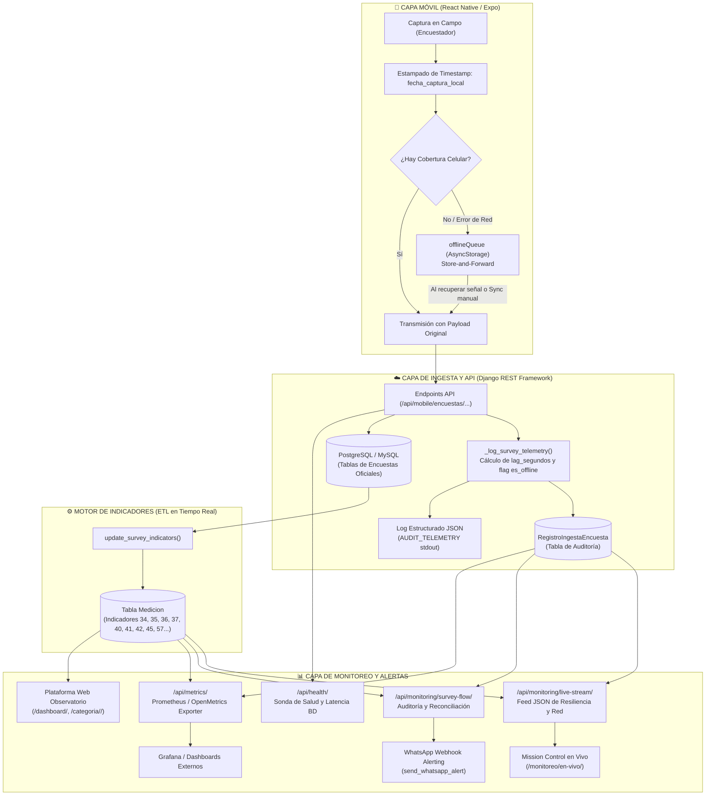

# 🛰️ Estrategia de Observabilidad, Telemetría y Monitoreo del Flujo de Datos
### Observatorio de Datos Huaquechula — Flujo Móvil (Edge) hacia Plataforma Web y Base de Datos

---

## 1. Resumen Ejecutivo y Objetivos

El levantamiento de encuestas en el municipio de **Huaquechula, Puebla** presenta retos operativos de conectividad celular: diversas localidades y juntas auxiliares (tales como Huiluco, Cacaloxúchitl, Soto y Gama o zonas periféricas) experimentan sombras de cobertura o desconexiones temporales. 

Para garantizar que **el 100% de los datos levantados por los encuestadores en campo lleguen íntegros, sin duplicados ni pérdidas**, y se transformen automáticamente en indicadores visibles en la página web del Observatorio, se diseñó e implementó una **estrategia integral de observabilidad y resiliencia de extremo a extremo (E2E)** basada en tres pilares de ingeniería de fiabilidad:

1. **Métricas en Tiempo Real**: Exposición OpenMetrics / Prometheus (`/api/metrics/`) y telemetría de latencia de base de datos.
2. **Auditoría Estructurada y Trazabilidad**: Sellado temporal en el móvil (*timestamping local*), logging estructurado en formato JSON y persistencia en la tabla `RegistroIngestaEncuesta`.
3. **Reconciliación y Resiliencia Activa**: Detección de desfasamiento temporal (*lag por cobertura*), patrón *Store-and-Forward* en el cliente y recálculo automático de indicadores estadísticos en la plataforma web.

---

## 2. Arquitectura de Flujo de Datos y Puntos de Observabilidad



---

## 3. Desglose de las Capas de Observabilidad

### 3.1. Capa Cliente: Resiliencia y Metadatos en el Teléfono Móvil

En la aplicación móvil (`ObservatorioMovil`):

1. **Sellado de Tiempo en Origen (*Origin Timestamping*)**:
   Cada vez que el encuestador finaliza una encuesta en campo, el servicio (`encuestasService.js` / `visitasService.js`) inyecta automáticamente la marca temporal exacta:
   ```javascript
   const payload = {
       ...datos,
       fecha_captura_local: datos.fecha_captura_local || new Date().toISOString(),
   };
   ```
   Esto evita que una encuesta completada a las 10:00 AM en una zona sin señal parezca realizada a las 4:00 PM cuando el teléfono se sincroniza en la cabecera municipal.

2. **Detección Fina de Errores de Red**:
   Se implementó la función discriminadora `esErrorDeRed(error)`:
   - Errores 400 (Bad Request): Se re-lanzan inmediatamente a la interfaz para alertar al encuestador sobre validación de datos incorrectos.
   - Timeouts, fallos DNS, errores de red (offline) o 502/503/504: Se interceptan automáticamente sin frustrar al usuario.

3. **Almacenamiento Local Seguro (Store-and-Forward)**:
   A través de `offlineQueue.js`, la encuesta se serializa en `AsyncStorage` (`@observatorio_offline_queue_v1`). Las encuestas quedan etiquetadas en la UI como `🟡 Guardado Localmente (Pendiente)`.

4. **Event Bus Reactivo (Pub/Sub)**:
   Para evitar inconsistencias visuales, `offlineQueue` cuenta con un sistema de suscripción de eventos (`subscribe`, `notifyListeners`). Cuando se encola o se sincroniza una encuesta:
   - Se notifica a `SelectorEncuestasScreen` para actualizar el contador de pendientes.
   - Se notifica a `MisEncuestasScreen` para actualizar inmediatamente las tarjetas sin reiniciar la aplicación.

---

### 3.2. Capa Backend: Auditoría de Ingesta y Detección de Rezago

En el backend Django (`myapp/api_views.py`):

1. **El Algoritmo de Medición de Retardo (*Network Lag*)**:
   Al recibir la petición, la función `_log_survey_telemetry` evalúa la diferencia entre el tiempo de llegada y la captura local:
   $$\text{lag\_segundos} = \max\left(0.0, \; t_{\text{servidor}} - t_{\text{captura\_local}}\right)$$
   - Si $\text{lag\_segundos} \ge 15.0\text{ s}$, el registro se clasifica con `es_offline = True`.

2. **Persistencia en Modelo `RegistroIngestaEncuesta`**:
   Cada ingesta se registra con los siguientes atributos:
   | Campo | Tipo | Propósito |
   |---|---|---|
   | `fecha_ingesta` | DateTime (auto) | Hora exacta de recepción en el servidor en la nube. |
   | `fecha_captura_local` | DateTime | Hora en que el encuestador presionó "Guardar" en el móvil. |
   | `tipo_encuesta` | CharField | `visitante`, `residente`, `institucional`, `comercio`, `dinamica`, `visita`. |
   | `id_encuesta` | PositiveInt | Llave primaria asignada en la tabla transaccional correspondiente. |
   | `encuestador_username` | CharField | Identificador del encuestador que levantó la encuesta. |
   | `barrio_localidad` | CharField | Ubicación geográfica reportada (Junta Auxiliar, Barrio o Colonia). |
   | `lag_segundos` | FloatField | Rezago total en segundos. |
   | `es_offline` | BooleanField | Flag que confirma si la encuesta vino de la cola diferida offline. |
   | `latencia_db_ms` | FloatField | Tiempo que tardó la base de datos en procesar la transacción. |
   | `estado` | CharField | `EXITOSO` o `ERROR`. |

3. **Logs Estructurados (JSON Output)**:
   El servidor emite en consola un registro estructurado en JSON para agentes de observabilidad (Promtail, Vector, Logstash o Fly.io Logs):
   ```json
   {
     "event": "SURVEY_INGESTION",
     "survey_type": "visitante",
     "survey_id": 42,
     "encuestador": "maria_huaquechula",
     "barrio_localidad": "Santa Ana Coatepec",
     "lag_segundos": 1420.5,
     "es_offline": true,
     "indicators_recalculated": true,
     "latency_ms": 32.4,
     "success": true,
     "timestamp": "2026-09-27T21:40:00.123456Z"
   }
   ```

---

### 3.3. Capa de Integridad: Reconciliación Estadística en Tiempo Real

Para asegurar que los datos no se queden estancados como simples filas en la base de datos sino que impacten a los ciudadanos e investigadores:

1. **Disparador Transaccional (`update_survey_indicators`)**:
   Tras guardar con éxito la encuesta, el backend ejecuta la función de actualización de indicadores en `myapp/utils_surveys.py`:
   - **Indicador ID 57**: Satisfacción promedio del visitante con su experiencia en Huaquechula.
   - **Indicador ID 34**: Nivel de tensión sobre la población local durante festividades.
   - **Indicador ID 35**: Porcentaje de acceso a servicios públicos básicos durante eventos.
   - **Indicador ID 36**: Preservación simbólica y tensiones sobre tradiciones.
   - **Indicador ID 37**: Procesos activos de salvaguardia del Patrimonio Cultural Inmaterial.
   - **Indicador ID 41**: Participación comunitaria en la toma de decisiones.
   - **Indicador ID 42**: Capacitación turística recibida por la población.
   - **Indicador ID 45**: Proyectos turísticos con beneficio económico directo.
   - **Indicador ID 40**: Nivel de involucramiento de las juventudes en tradiciones locales.

2. **Detección de Rupturas de Reconciliación (*Sync Warnings*)**:
   El endpoint de auditoría verifica activamente la coherencia:
   - Si existen encuestas de visitantes pero el indicador 57 no tiene medición registrada para el año en curso, emite una advertencia de estado `warning`.
   - Si existen encuestas de residentes pero el indicador 34 no está calculado, emite una alerta para intervención administrativa.

---

## 4. Endpoints y Superficie de Monitoreo

El sistema expone 5 endpoints especializados en `myapp/views_monitoring.py`:

### 4.1. Sonda de Salud (`GET /api/health/`)
* **Uso**: Liveness y Readiness probe para balanceadores de carga, Fly.io health checks y monitores externos (Uptime Kuma, Better Stack).
* **Respuesta**: Retorna `HTTP 200` con latencia en milisegundos si PostgreSQL/MySQL responde a la consulta `SELECT 1`, o `HTTP 503 Service Unavailable` si la base de datos no está disponible.
```json
{
  "status": "healthy",
  "database": "connected",
  "latency_ms": 2.15,
  "timestamp": "2026-09-27T22:45:00.000Z",
  "service": "Observatorio Huaquechula Core API"
}
```

### 4.2. Estado y Reconciliación del Flujo (`GET /api/monitoring/survey-flow/`)
* **Uso**: Diagnóstico de ingesta y reconciliación de mediciones.
* **Métricas devueltas**:
  - Conteo total y por categoría (Visitantes, Residentes, Institucionales, Comercios, Registros de Visita).
  - Información de la última encuesta recibida (tipo, ID, minutos transcurridos).
  - Estado del pipeline (`healthy` o `warning`).
  - Lista de advertencias de reconciliación (`sync_warnings`).

### 4.3. Streaming de Telemetría en Vivo (`GET /api/monitoring/live-stream/`)
* **Uso**: Alimenta en tiempo real el Mission Control web.
* **Métricas devueltas**:
  - Total de encuestas recibidas en tiempo real vs. recuperadas tras almacenamiento offline.
  - Promedio y máximo de rezago (`lag_segundos`).
  - Histograma de distribución del lag:
    - **Instantáneas**: $< 15\text{ s}$
    - **Rezago Ligero**: $15\text{ s} - 2\text{ min}$
    - **Rezago Moderado**: $2\text{ min} - 15\text{ min}$
    - **Rezago Alto**: $> 15\text{ min}$
  - Ranking de los barrios y juntas auxiliares con mayor actividad en campo.
  - Feed de los últimos 35 eventos detallados con encuestador, barrio, lag y latencia de BD.

### 4.4. Exportador OpenMetrics / Prometheus (`GET /api/metrics/`)
* **Uso**: Scraping periódico por Prometheus Server o Grafana Agent.
* **Métricas exportadas**:
  ```text
  # HELP huaquechula_surveys_total Total de encuestas registradas por tipo
  # TYPE huaquechula_surveys_total counter
  huaquechula_surveys_total{tipo="visitante"} 145
  huaquechula_surveys_total{tipo="residente"} 89
  huaquechula_surveys_total{tipo="institucional"} 12
  huaquechula_surveys_total{tipo="comercio"} 34
  huaquechula_surveys_total{tipo="conteo_visita"} 510

  # HELP huaquechula_network_resilience_events Eventos de ingesta analizados por resiliencia de red
  # TYPE huaquechula_network_resilience_events counter
  huaquechula_network_resilience_events{status="realtime"} 230
  huaquechula_network_resilience_events{status="offline_buffered"} 60
  huaquechula_network_resilience_events{status="total_audited"} 290

  # HELP huaquechula_network_lag_seconds Rezago temporal en segundos por desconexion en campo
  # TYPE huaquechula_network_lag_seconds gauge
  huaquechula_network_lag_seconds{metric="promedio"} 412.30
  huaquechula_network_lag_seconds{metric="maximo"} 3600.00

  # HELP huaquechula_database_latency_seconds Latencia de respuesta de PostgreSQL
  # TYPE huaquechula_database_latency_seconds gauge
  huaquechula_database_latency_seconds 0.0035

  # HELP huaquechula_database_connected Estado de conexion a la base de datos (1=ok, 0=error)
  # TYPE huaquechula_database_connected gauge
  huaquechula_database_connected 1

  # HELP huaquechula_indicator_reconciled Estado de reconciliacion de indicadores clave (1=ok)
  # TYPE huaquechula_indicator_reconciled gauge
  huaquechula_indicator_reconciled{indicador="satisfaccion_57"} 1
  huaquechula_indicator_reconciled{indicador="tension_34"} 1
  ```

---

## 5. Centro de Mando Gráfico en Vivo (Mission Control)

Accesible vía web en:
`https://observatorio-huaquechula.fly.dev/monitoreo/en-vivo/` (o en local en `http://localhost:8000/monitoreo/en-vivo/`).

El panel está desarrollado con **Chart.js** y tema oscuro operacional:
1. **Header Operativo con Pulso de Vida**: Indicador visual dinámico (verde pulsante si el pipeline está sano, ámbar/rojo si hay degradación o desconexión).
2. **Tarjetas KPI**:
   - Total de Encuestas Recibidas.
   - Latencia de la Base de Datos (ms).
   - Tasa de Resiliencia Offline (% de encuestas salvadas sin cobertura celular).
   - Rezago Promedio de Conexión en Campo.
3. **Gráfico de Resiliencia de Cobertura**: Gráfica de dona que compara transmisiones instantáneas vs. transmisiones sincronizadas en lote por falta de señal.
4. **Gráfico de Retardo Temporal**: Histograma categorizado por rangos de tiempo de desconexión.
5. **Radar Territorial**: Distribución de levantamientos por localidad (Cabecera, Huiluco, Cacaloxúchitl, Coatepec, etc.).
6. **Consola de Telemetría en Vivo**: Tabla auto-actualizable que detalla cada encuesta recibida, el usuario encuestador, el barrio y el estado del recálculo de indicadores.

---

## 6. Sistema de Alertas Automáticas vía WhatsApp

Se integró la función `send_whatsapp_alert(mensaje)` para notificaciones proactivas de incidentes:
* **Configuración**: Variable de entorno `WHATSAPP_WEBHOOK_URL` (compatible con webhooks directos de Twilio, Make, Zapier, CallMeBot o puentes HTTP).
* **Disparadores**:
  - Detección de caída de conexión a la base de datos en el *health check*.
  - Desconexión del flujo o retraso superior al umbral de seguridad en jornadas de campo.
  - Alertas de discrepancia estadística (encuestas registradas sin medición asociada).
* **Endpoint de Diagnóstico**:
  `POST /api/monitoring/test-alert/` permite verificar el envío de alertas de prueba desde consola o Postman.

---

## 7. Protocolo de Verificación Operativa para Administradores

| Objetivo | Acción / Endpoint | Resultado Esperado |
|---|---|---|
| **Verificar salud general de la API** | `curl -i https://observatorio-huaquechula.fly.dev/api/health/` | `HTTP 200 OK`, `"status": "healthy"`, `"database": "connected"` |
| **Auditar consistencia del flujo** | `GET /api/monitoring/survey-flow/` | `"pipeline_status": "healthy"`, `"sync_warnings": []` |
| **Supervisar telemetría en tiempo real** | Abrir `/monitoreo/en-vivo/` en navegador | Gráficos cargados y tabla de eventos actualizándose cada pocos segundos. |
| **Consultar métricas en Prometheus** | `curl https://observatorio-huaquechula.fly.dev/api/metrics/` | Texto plano en formato OpenMetrics listo para Grafana. |
| **Probar alerta de emergencia** | `curl -X POST https://observatorio-huaquechula.fly.dev/api/monitoring/test-alert/ -d "message=Prueba"` | `{"status": "sent"}` (si el webhook está configurado). |

---

## 8. Conclusiones y Valor para el Proyecto

Gracias a esta arquitectura de observabilidad:
1. **Cero Pérdida de Datos**: Aunque los encuestadores operen en barrancas o comunidades con señal nula, ninguna encuesta se extravía; el almacenamiento local y la sincronización reactiva garantizan su llegada.
2. **Trazabilidad Científica**: Cada dato en el Observatorio conserva la fecha real en que la persona fue encuestada, preservando la validez estadística de los estudios de turismo y comunidad.
3. **Visibilidad Total para el Equipo Directivo**: Los coordinadores del Observatorio pueden monitorear desde el Centro de Mando cómo avanzan las brigadas en campo en tiempo real, qué zonas tienen menor cobertura celular y cuándo se calculan los indicadores municipales.
