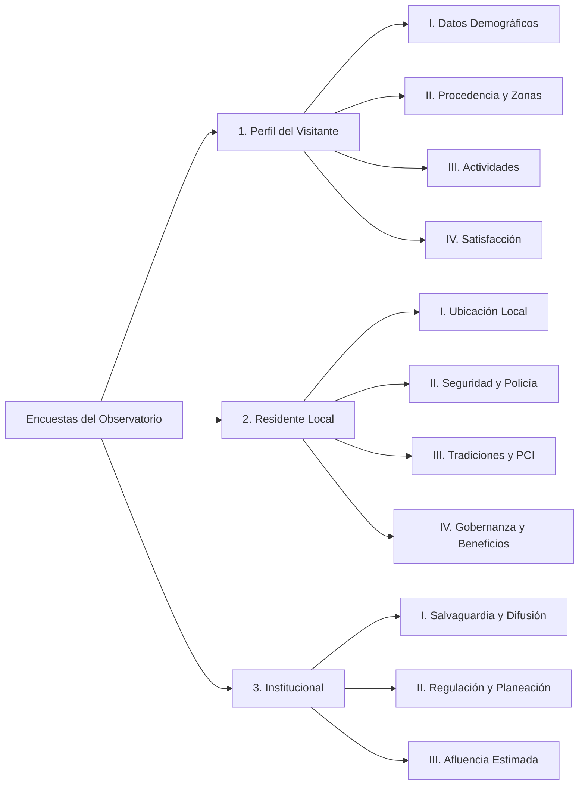

# Manual de Campo del Encuestador y Contenido Oficial de Encuestas
**Observatorio de Datos Turísticos y Culturales de Huaquechula**  
*Guía operativa para jóvenes encuestadores y brigadas de levantamiento en campo*

---

## 📌 1. Información General y Políticas de Acceso

¡Bienvenidos y bienvenidas a la brigada de levantamiento de datos del **Observatorio de Datos Huaquechula**! Tu participación como joven encuestador o encuestadora es fundamental para registrar de manera fidedigna la realidad turística, social, comunitaria y patrimonial de nuestro municipio.

> [!IMPORTANT]
> ### 🔐 Entrega de Credenciales de Acceso
> **El usuario y la contraseña son generados y otorgados exclusivamente por el Administrador del Observatorio.**  
> - La aplicación móvil **NO** cuenta con registro público abierto para garantizar la autenticidad y trazabilidad de los datos recolectados.  
> - Antes de salir a campo, el administrador te asignará una cuenta personal intransferible (por ejemplo: `usuario: tu_nombre`, `contraseña: <asignada_por_admin>`).  
> - Cada encuesta enviada quedará firmada digitalmente con tu clave de encuestador para auditoría y reconocimiento de tu labor.

---

## 📱 2. Guía Paso a Paso: Uso de la Aplicación Móvil en Campo

La aplicación oficial que utilizarás en tu teléfono Android se titula:  
**"Encuestas moviles-Observatorio Huaquechula"** (`EncuestasMoviles-Huaquechula-v1.0.2.apk`).

### Paso 1: Instalación y Primer Acceso
1. Descarga e instala el archivo APK facilitado por el equipo de coordinación.
2. Si tu teléfono solicita permisos para *"Instalar aplicaciones de fuentes desconocidas"*, concédelo marcando la casilla de confirmación.
3. Abre la aplicación con el icono del **Observatorio de Huaquechula**.
4. En la pantalla de bienvenida (**Inicio de Sesión**):
   - Ingresa el **Usuario** otorgado por el administrador.
   - Ingresa tu **Contraseña**.
   - Presiona el botón verde **"Iniciar Sesión"**.
5. Tras verificar tus credenciales, entrarás directamente al **Portal del Encuestador**.

---

### Paso 2: Conociendo la Pantalla Principal (Portal del Encuestador)
En la parte superior verás tu tarjeta de perfil con tu nombre y usuario (`👤 @usuario`). Debajo encontrarás el catálogo de encuestas disponibles:
1. 🗺️ **Encuesta: Perfil del Visitante** (Para turistas, excursionistas y personas de fuera del municipio).
2. 🏠 **Encuesta: Residente Local** (Para personas que viven en los barrios o juntas auxiliares de Huaquechula).
3. 🏛️ **Encuesta: Institucional** (Para autoridades, dependencias públicas, mayordomías y comités comunitarios).
4. 👥 **Registro Rápido de Visitas** (Conteo ágil de afluencia, origen y motivo de viaje).
5. 📋 **Encuestas Personalizadas** (Encuestas dinámicas especiales configuradas desde el panel central).

---

### Paso 3: Cómo Levantar una Encuesta en Campo
1. **Identifica a la persona adecuada**:
   - Si es un visitante o turista paseando por el Ex Convento, el zócalo o altares ➔ Abre **Perfil del Visitante**.
   - Si es un vecino, comerciante tradicional o residente de una junta auxiliar ➔ Abre **Residente Local**.
   - Si es un representante de una asociación, dependencia o comité organizador ➔ Abre **Institucional**.
2. **Presentación respetuosa**:
   - Saluda cordialmente y preséntate:  
     > *"Hola, buenos días/tardes. Formo parte de la brigada de jóvenes del Observatorio de Datos de Huaquechula. Estamos realizando un breve estudio para mejorar la preservación de nuestras tradiciones y los servicios a visitantes. ¿Me regala 3 minutos para contestar unas preguntas? Es totalmente anónimo."*
3. **Captura en la pantalla**:
   - Los campos con asterisco rojo (`*`) son obligatorios.
   - Usa los selectores táctiles tipo *chips* o casillas para capturar rápido sin tener que escribir todo en teclado.
   - En preguntas de ubicación, la app incluye un selector geográfico dinámico: al elegir el Estado, se despliegan automáticamente sus Municipios.
4. **Guardar la encuesta**:
   - Al terminar todas las preguntas, presiona el botón inferior verde: **"Guardar Encuesta"**.

---

### Paso 4: ¿Qué Pasa si No Hay Señal Celular? (Modo Offline Resiliente)

> [!TIP]
> ### 📶 Funcionamiento 100% Sin Conexión a Internet
> Huaquechula cuenta con barrancas, zonas rurales y puntos de sombra celular (como Matlala, Huiluco, áreas del Ex Convento o festividades con saturación de antenas). **No te preocupes:**
> 1. La aplicación **NO se detendrá ni perderá ningún dato** aunque no tengas internet, datos móviles o saldo.
> 2. Al pulsar *"Guardar Encuesta"* sin señal, verás la alerta:  
>    **"💾 Guardada en Modo Offline: Sin cobertura en este punto. La encuesta quedó guardada en el dispositivo."**
> 3. Al volver a la pantalla principal, verás un recuadro amarillo/ámbar indicando:  
>    **"📦 X encuestas pendientes guardadas localmente"**.
> 4. Puedes continuar encuestando a todas las personas que desees de manera consecutiva; cada una se almacenará de forma segura en la base de datos interna de tu teléfono.

---

### Paso 5: Cómo Sincronizar las Encuestas al Terminar la Jornada
1. Cuando regreses a la Cabecera Municipal, llegues a la universidad o te conectes a una red Wi-Fi o zona con buena señal 4G/LTE:
2. Abre la app en la pantalla principal.
3. Si el teléfono detecta señal estable, iniciará una **sincronización automática silenciosa en segundo plano**.
4. O bien, pulsa el botón naranja/ámbar: **"Sincronizar ⚡"**.
5. Verás el indicador de carga y recibirás la notificación:  
   **"✅ Sincronización Exitosa: Se enviaron X encuestas al servidor del Observatorio"**.
6. El contador volverá a `0` y las encuestas se reflejarán de inmediato en el Centro de Mando Web del Observatorio.

---

### 🛡️ Código de Ética y Buenas Prácticas para Encuestadores Jóvenes
- **Batería cargada**: Sal siempre a campo con tu teléfono al 100% de carga. Si es posible, lleva una batería externa (*powerbank*).
- **Consentimiento voluntario**: Nunca obligues a nadie a responder. Si alguien tiene prisa, agradece amablemente su tiempo.
- **Fidelidad de la respuesta**: Registra exactamente lo que la persona entrevistada responda, sin emitir juicios ni corregir su opinión.
- **Protección de datos personales**: No solicites apellidos completos, números telefónicos ni domicilios exactos; el estudio es con fines estadísticos y académicos.
- **Seguridad personal**: Realiza los levantamientos siempre en parejas o brigadas visibles, portando identificación o gafete si se te proporcionó.

---

## 📋 3. Contenido Completo de las Encuestas Oficiales

A continuación se detalla la estructura íntegra, preguntas, escalas y opciones de cada una de las tres encuestas oficiales del Observatorio:

---

### 🗺️ ENCUESTA 1: PERFIL DEL VISITANTE (Turistas y Excursionistas)
*Objetivo: Conocer de dónde provienen los visitantes de Huaquechula, con quién viajan, qué lugares recorren y qué tan satisfechos están con su experiencia.*

#### Bloque I: Perfil Demográfico
1. **Género**:
   - `Femenino`
   - `Masculino`
   - `No binario / Otro`
   - `Prefiero no decirlo`
2. **Edad**:
   - Campo numérico (ejemplo: `24`, `38`, `52` años).
3. **¿Con quién viaja?**:
   - `Solo / Sola`
   - `En pareja`
   - `En familia (con niños)`
   - `Con amigos / familiares (adultos)`
   - `Grupo organizado / Excursión`

#### Bloque II: Origen y Lugares Visitados
4. **País de Procedencia**:
   - Selector nacional/internacional (Predeterminado: `México`).
5. **Estado de Procedencia**:
   - Selector dinámico de los 32 estados de la República Mexicana (ejemplo: `Puebla`, `Ciudad de México`, `Morelos`, `Tlaxcala`, etc.).
6. **Ciudad o Municipio de Procedencia**:
   - Selector dinámico cargado según el estado elegido (ejemplo: `Puebla`, `Atlixco`, `Izúcar de Matamoros`, `San Pedro Cholula`, `Cuernavaca`, etc.).
7. **Zonas o Atractivos visitados en Huaquechula** *(Selección múltiple)*:
   - [ ] 📍 `Centro / Zócalo Histórico`
   - [ ] 🛕 `Altares Monumentales de Día de Muertos`
   - [ ] 🏛️ `Ex Convento Franciscano`
   - [ ] 🌲 `Páramo de los Duendes`
   - [ ] 🌊 `Acueducto de Matlala`
   - [ ] 🗿 `Piedras Arqueológicas / Pinturas Rupestres`

#### Bloque III: Actividades Realizadas
8. **¿Qué actividades realizó o planea realizar durante su visita?** *(Selección múltiple)*:
   - [ ] Probar la gastronomía local / ir a restaurantes o fondas tradicionales
   - [ ] Visitar museos, iglesias o sitios históricos
   - [ ] Comprar artesanías o productos típicos locales (chocolate, pan, hojaldras)
   - [ ] Actividades de naturaleza / senderismo / aventura
   - [ ] Asistir a una fiesta patronal, festival cultural o procesión tradicional
   - [ ] Turismo de negocios / eventos de trabajo
   - [ ] Descanso y relajación

#### Bloque IV: Nivel de Satisfacción
9. **En general, ¿cómo califica su experiencia de visita en Huaquechula?**:
   - ⭐ `1 - Muy mala`
   - ⭐⭐ `2 - Mala`
   - ⭐⭐⭐ `3 - Regular`
   - ⭐⭐⭐⭐ `4 - Buena`
   - ⭐⭐⭐⭐⭐ `5 - Excelente`
10. **¿Qué fue lo que más le gustó de su estancia en Huaquechula?**:
    - Campo de texto libre breve (ejemplo: *"La calidez de la gente y el chocolate con pan"*, *"Los altares monumentales"*, *"La arquitectura del convento"*).

---

### 🏠 ENCUESTA 2: RESIDENTE LOCAL (Comunidad de Huaquechula)
*Objetivo: Evaluar el impacto del turismo en la vida cotidiana de los huaquechulenses, la percepción de seguridad, la preservación de tradiciones (PCI) y el acceso a servicios.*

#### Bloque I: Ubicación y Datos Demográficos
1. **Comunidad o Junta Auxiliar de Origen**:
   - `Cabecera Municipal (Huaquechula Centro)`
   - `Cacaloxúchitl`
   - `Mártir Cuauhtémoc`
   - `San Antonio Cuautla`
   - `San Diego el Organal`
   - `San Juan Huiluco`
   - `Santa Ana Coatepec`
   - `Santiago Tetla`
   - `Soledad Morelos`
   - `Teacalco de Dorantes`
   - `Tezonteopan de Bonilla`
   - `Otra localidad / inspectoría rural`
2. **Barrio o Colonia específica**:
   - Campo de texto (ejemplo: *Barrio de San Jerónimo*, *Barrio del Rosario*, *Centro*, etc.).
3. **Edad**: Campo numérico.
4. **Género**: `Mujer` | `Hombre` | `Otro` | `Prefiero no decirlo`.

#### Bloque II: Seguridad Pública y Confianza Institucional
5. **Nivel de confianza en la policía y cuerpos de seguridad local**:
   - `1 - Nula confianza`
   - `2 - Poca confianza`
   - `3 - Regular`
   - `4 - Mucha confianza`
   - `5 - Total confianza`
6. **Percepción de inseguridad en su colonia o comunidad**:
   - `1 - Muy inseguro`
   - `2 - Inseguro`
   - `3 - Neutral / Término medio`
   - `4 - Seguro`
   - `5 - Muy seguro`

#### Bloque III: Patrimonio Cultural Inmaterial (PCI) y Vida Comunitaria
7. **¿Siente tensión o saturación por el exceso de visitantes durante festividades (p. ej. Día de Muertos, Semana Santa o Fiesta Patronal)?**:
   - `1 - No altera nada (convivencia tranquila)`
   - `2 - Altera poco`
   - `3 - Altera de forma regular`
   - `4 - Altera mucho (saturación y estrés vecinal)`
8. **¿Se ve afectado su acceso a servicios básicos (agua potable, recolección de basura, tránsito vehicular) durante los eventos turísticos?**:
   - `Excelente (los servicios funcionan con normalidad)`
   - `Regular (hay demoras o cortes temporales)`
   - `Deficiente (los servicios colapsan durante las fiestas)`
9. **¿Considera que se está perdiendo el respeto o el sentido sagrado de las tradiciones por la llegada masiva de turistas?**:
   - `Sí, se ha comercializado excesivamente`
   - `Parcialmente (algunas partes han cambiado)`
   - `No, se mantiene intacta y con profundo respeto`
10. **¿Observa interés y participación activa de las juventudes locales en conservar las tradiciones?**:
    - `Sí, participan de forma activa`
    - `Parcialmente`
    - `No, el interés de los jóvenes se está perdiendo`

#### Bloque IV: Gobernanza y Beneficio Comunitario
11. **¿Usted o su familia participan en actividades de conservación del patrimonio o las festividades?**:
    - `Sí, participo activamente de manera directa (mayordomías, altares, comités)`
    - `No participo directamente, pero apoyo la organización local`
    - `No participo en absoluto`
12. **¿Ha sido convocado o asiste a reuniones para la toma de decisiones comunitarias sobre turismo?**:
    - `Sí, asisto con regularidad y se toman en cuenta mis opiniones`
    - `He sido convocado, pero no asisto o no se toman en cuenta las opiniones comunitarias`
    - `Nunca he sido convocado ni informado sobre estas decisiones`
13. **¿Ha recibido talleres, cursos o capacitación en temas turísticos, artesanales o de atención al visitante?**:
    - `Sí, he recibido capacitación continua`
    - `Recibí información aislada, pero no capacitación formal`
    - `No he recibido ninguna información ni capacitación`
14. **¿Percibe que el turismo aporta un beneficio económico o social directo a su hogar?**:
    - `Sí, es nuestra fuente de ingresos principal`
    - `Sí, funciona como una actividad económica complementaria`
    - `No, no percibimos ningún beneficio directo de la actividad turística`

---

### 🏛️ ENCUESTA 3: INSTITUCIONAL (Dependencias, Mayordomías y Autoridades)
*Objetivo: Diagnosticar la capacidad de gestión técnica, el marco regulatorio, las estrategias de salvaguardia patrimonial y la afluencia de visitantes en el municipio.*

#### Bloque I: Salvaguardia y Canales de Difusión
1. **¿El municipio o la organización cuenta con herramientas sistemáticas de seguimiento o inventario del Patrimonio Cultural Inmaterial (PCI)?**:
   - `Sí, contamos con herramientas de monitoreo e inventarios sistemáticos`
   - `Se realizan registros eventuales (fotografías o bitácoras de eventos), pero sin un sistema formal`
   - `No se cuenta con herramientas institucionales de seguimiento`
2. **¿Qué canales de difusión institucional se emplean para promover Huaquechula?** *(Selección múltiple)*:
   - [ ] Campañas digitales y uso de redes sociales institucionales
   - [ ] Vinculación con agencias de viaje o secretarías de turismo estatal/federal
   - [ ] Publicaciones académicas, folletería impresa y guías locales
   - [ ] Eventos, ferias de turismo o intercambios culturales exteriores
   - [ ] Ninguno
3. **Estimación de visitantes durante festividades cumbre (Día de Muertos / Fiesta Patronal)**:
   - Campo numérico (ejemplo: `25000`, `30000`, etc.).

#### Bloque II: Regulación, Ordenamiento y Cobertura Territorial
4. **¿Se cuenta con instrumentos normativos o reglamentos para regular la actividad turística y comercial?**:
   - `Reglamento de turismo vigente que incluye normativas de protección local y ordenamiento comercial`
   - `Normas básicas de comercio, pero sin un reglamento específico orientado a la protección cultural`
   - `No existen herramientas de regulación turística vigentes`
5. **¿Se cuenta con instrumentos de planeación técnica o sectorial en turismo?**:
   - `Sí, se cuenta con un Plan Sectorial alineado a la gestión comunitaria`
   - `Existe un plan de desarrollo general, pero carece de un enfoque específico en turismo comunitario`
   - `No se cuenta con herramientas de planeación técnica o estratégica en turismo`
6. **Nivel de integración de las localidades rurales del municipio en la oferta turística**:
   - `Menos del 25% de las localidades (La actividad se centraliza casi por completo en la cabecera municipal)`
   - `Entre el 25% y el 50% de las localidades están integradas`
   - `Más del 50% de las localidades rurales participan activamente en las redes de turismo municipal`
7. **Estimación anual global de visitantes en el municipio**:
   - Campo numérico (ejemplo: `80000`, `120000`).

---

## 💡 Preguntas Frecuentes para el Encuestador (FAQ)

- **¿Qué hago si se traba la app o me equivoco en una respuesta?**  
  Puedes cambiar cualquier selección antes de presionar el botón *"Guardar Encuesta"*. Si una persona decide no terminar la entrevista a la mitad, simplemente presiona la flecha de retroceso arriba a la izquierda para cancelar el registro.
- **¿Puedo encuestar si la pantalla dice "Sin Conexión"?**  
  **Sí, completamente.** La aplicación almacena de forma local y segura en la memoria de tu dispositivo todo lo que captures. El semáforo amarillo te recordará sincronizar cuando regreses a un punto con señal.
- **¿Qué pasa si olvido mi contraseña?**  
  Debes contactar de inmediato al Administrador del Observatorio (`Edgar`, `Kevin` o `Brayan`). Ellos tienen acceso al panel de usuarios para restaurar tu clave al instante.
- **¿Puedo usar mi propia cuenta en otro teléfono?**  
  Sí, puedes iniciar sesión en otro dispositivo Android instalando el APK e introduciendo tus mismas credenciales oficiales.
