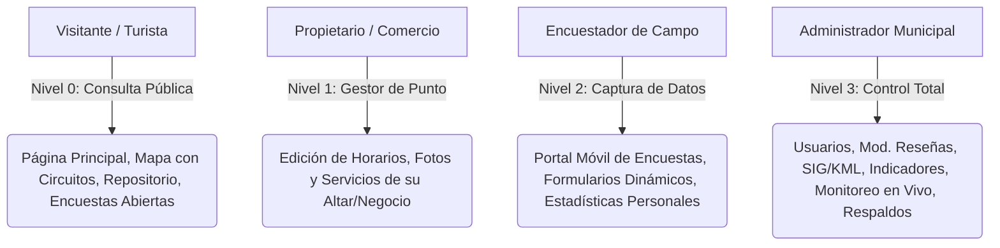
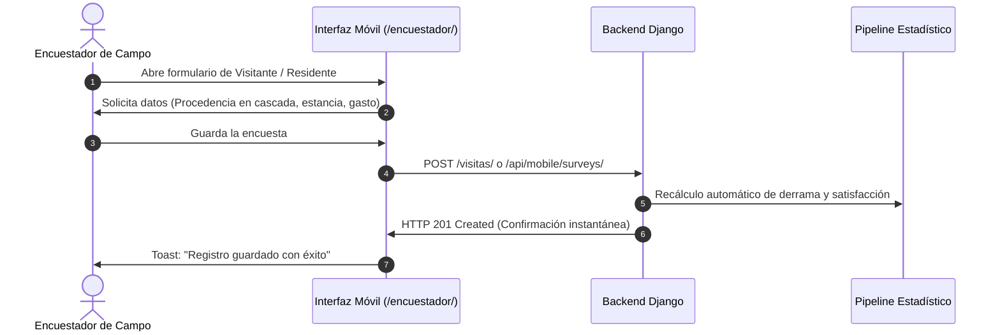

# Manual de Operación y Administración Municipal
## Observatorio de Datos e Inteligencia Territorial — Huaquechula, Puebla

---

### Control del Documento
- **Documento:** Guía Oficial de Operación, Uso y Administración del Sistema
- **Municipio:** H. Ayuntamiento de Huaquechula, Puebla (2024–2027)
- **Áreas Destinatarias:** Dirección de Turismo, Dirección de Cultura, Dirección de Planeación y Tecnologías de la Información
- **Versión:** 2.0 (Producción)
- **Fecha de Emisión:** Septiembre 2026
- **Entorno en Producción:** [https://observatorio-huaquechula.fly.dev](https://observatorio-huaquechula.fly.dev)

---

## 1. Introducción y Propósito

El **Observatorio de Datos e Inteligencia Territorial de Huaquechula** es una infraestructura tecnológica integral concebida para:
1. Medir, analizar y salvaguardar el patrimonio cultural tangible e intangible del municipio, con énfasis en la **Festividad de Todos Santos y sus Ofrendas Monumentales** (Patrimonio Cultural del Estado de Puebla).
2. Monitorear los indicadores de **Bienestar Social, Dinámica Turística y Desarrollo Económico Comunitario**.
3. Dotar al visitante y ciudadano de una **Guía Interactiva Turística con Rutas Optimizadas (Circuitos Turísticos)** en tiempo real.
4. Facilitar a las autoridades municipales una herramienta de toma de decisiones basada en evidencia estadística auditable.

Este manual detalla los procedimientos operativos para cada uno de los roles del sistema, desde el levantamiento de encuestas en campo hasta la gobernanza de datos y copias de seguridad.

---

## 2. Roles, Perfiles y Niveles de Acceso

La plataforma cuenta con un esquema de control de acceso basado en roles (RBAC) con 4 niveles:



### Tabla de Matriz de Permisos

| Módulo / Funcionalidad | Turista / Público | Propietario / Comercio | Encuestador | Administrador |
| :--- | :---: | :---: | :---: | :---: |
| Consulta del Mapa y Circuitos Turísticos | Sí | Sí | Sí | Sí |
| Emisión de Reseñas y Calificaciones | Sí (con reCAPTCHA) | Sí | Sí | Sí |
| Descarga de Documentos del Repositorio | Sí | Sí | Sí | Sí |
| Visualización del Dashboard e Indicadores | Sí | Sí | Sí | Sí |
| Responder Encuestas Públicas por QR/Enlace | Sí | Sí | Sí | Sí |
| Gestión de Horarios/Fotos de Altar Asignado | No | Sí (`/mis-propiedades/`) | No | Sí |
| Portal de Encuestador y Captura de Campo | No | No | Sí (`/encuestador/`) | Sí |
| Creación de Encuestas Dinámicas | No | No | No | Sí (`/encuestas/`) |
| Carga de Capas Cartográficas KMZ/KML | No | No | No | Sí (`/lista-archivos/`) |
| Moderación de Reseñas y Comentarios | No | No | No | Sí (`/resenas/`) |
| Centro de Monitoreo y Observabilidad en Vivo | No | No | No | Sí (`/monitoreo/en-vivo/`) |
| Respaldo de Base de Datos PostgreSQL | No | No | No | Sí (`/backup/`) |

---

## 3. Guía de Inicio de Sesión y Gestión de Cuentas

### 3.1. Acceso al Panel
1. Ingrese a la plataforma y haga clic en **"Iniciar Sesión"** o navegue a `/login/`.
2. Ingrese su **Nombre de Usuario** y **Contraseña**.
3. Si la cuenta tiene activada autenticación reforzada, ingrese el token de verificación recibido vía correo electrónico.
4. El sistema redirige automáticamente al usuario según su rol:
   - **Administrador:** Panel de Control / Menú de navegación administrativo superior.
   - **Encuestador:** Portal del Encuestador (`/encuestador/`).
   - **Propietario:** Mis Propiedades (`/mis-propiedades/`).

### 3.2. Alta y Baja de Cuentas (Solo Administrador)
Para gestionar el personal de la temporada (encuestadores de apoyo, personal de servicio social):
1. Ingrese al menú lateral o navegue a `/usuarios/`.
2. Para registrar un nuevo encuestador, presione el botón **"Nuevo Usuario"**:
   - Complete Nombre, Apellidos, Nombre de Usuario, Correo Electrónico y Contraseña provisoria.
   - En el campo **Tipo de Usuario**, seleccione `Encuestador`.
   - Guarde los cambios. El encuestador ya puede ingresar con su móvil al portal.
3. Para inactivar a un encuestador al término de la temporada de Todos Santos, localice su registro en la tabla y presione el botón rojo de eliminación/desactivación.

---

## 4. Operación del Encuestador en Campo

El módulo del encuestador está optimizado para teléfonos móviles (smartphones) y tabletas, con soporte de almacenamiento local temporal (LocalStorage) para evitar pérdidas de información ante intermitencias en la señal de telefonía celular.



### 4.1. Tipos de Formularios de Campo

#### A. Registro Rápido de Afluencia (`/visitas/registro/` o botón "+ Nuevo Registro")
Diseñado para puntos de aforo en accesos al municipio (Arcos de entrada, Zócalo, Estacionamientos):
- **Selector de Procedencia en Cascada:**
  - Si es **México**: Seleccione el Estado (ej. Puebla, CDMX, Morelos, Tlaxcala) y el Municipio. Si no figura en lista, marque "Otro" y escriba la localidad.
  - Si es **Extranjero**: Seleccione el país (ej. Estados Unidos, España, Alemania, Francia) y capture la ciudad.
- **Distribución por Género y Grupos de Edad:**
  - Ingrese el número de mujeres y hombres en los rangos: `0-15 años`, `16-30 años`, `31-50 años` y `51+ años`.
  - El sistema suma en tiempo real el total de personas del grupo.
- **Detalles del Viaje:**
  - Medio de transporte (Automóvil, Autobús tour, Avión, etc.).
  - Estancia esperada (en días) y número de visitas previas a Huaquechula.

#### B. Encuesta a Residentes Locales (`/encuestador/residente/`)
Diseñada para conocer la percepción ciudadana sobre el turismo:
- Comunidad o Junta Auxiliar de origen (El Tronconal, San Juan Huiluco, Soledad Morelos, etc.).
- Grado de beneficio percibido por la actividad turística (Escala Likert 1 a 5).
- Nivel de afectación en vialidad, residuos o tranquilidad durante las fiestas.

#### C. Encuesta a Prestadores y Sector Institucional (`/encuestador/institucional/`)
Aplicable a restaurantes, fondas, artesanos cereros y chocolate tradicional, así como directores de área municipal.

### 4.2. Buenas Prácticas durante Todos Santos
- **Batería y Conectividad:** Mantenga activada la geolocalización en su dispositivo; el formulario registra automáticamente la coordenada de levantamiento para auditoría espacial.
- **Verificación de Datos:** Antes de presionar "Guardar Encuesta", confirme que el número total de integrantes coincida con las personas físicamente presentes.
- **Rendimiento Individual:** En la pantalla principal de `/encuestador/`, cada brigadista puede observar su contador de encuestas completadas en la jornada y el promedio diario del equipo.

---

## 5. Módulo de Encuestas Dinámicas Personalizadas

Inspirado en Google Forms pero integrado con la base de datos municipal, este módulo permite a la Dirección de Turismo levantar encuestas temáticas específicas (ej. "Evaluación Gastronómica de Todos Santos", "Percepción de Seguridad Turística", "Concurso de Altares").

### 5.1. Crear una Encuesta (`/encuestas/crear/`)
1. Ingrese el **Título** (ej. *Encuesta de Calidad en Servicios Gastronómicos 2026*).
2. Redacte una **Descripción** clara orientada al ciudadano o visitante.
3. Defina los parámetros generales:
   - **Activa:** Marcar para que acepte respuestas de inmediato.
   - **Anónima:** Si se marca, no se solicita nombre ni correo al encuestado.
   - **Canales habilitados:** Web pública, App Móvil o Exclusiva de Encuestadores.
4. Presione **"Agregar Pregunta"** y configure cada reactivo:
   - **Texto corto / Texto largo:** Para comentarios o sugerencias.
   - **Opción Múltiple (Radio):** Para selección única exclusiva.
   - **Casillas de Verificación (Checkbox):** Para seleccionar varias opciones (ej. "¿Qué platillos degustó?").
   - **Escala de Calificación (1 a 5 Estrellas):** Para evaluar servicio, limpieza, señalización o precios.
5. Guarde la encuesta. El sistema genera de forma automática un **Código QR descargable** y una URL pública lista para compartir:
   `https://observatorio-huaquechula.fly.dev/encuestas/responder/<ID>/`

### 5.2. Análisis, Exportación y Publicación en Repositorio
En la vista `/encuestas/<id>/respuestas/`:
- **Gráficos en tiempo real:** Visualice la distribución porcentual de cada pregunta con gráficas de barras y pastel automáticas.
- **Exportar CSV:** Descargue la matriz completa de datos crudos tabulados con fecha, hora y coordenadas.
- **Publicar en Repositorio:** Con un solo clic, el sistema genera una síntesis estructurada del estudio y la archiva de forma pública en la sección de **"Reportes Técnicos"** del Repositorio Cultural (`/repositorio/`).

---

## 6. Módulo SIG: Puntos de Interés, Ofrendas y Circuitos Turísticos

El Sistema de Información Geográfica (SIG) municipal se compone de capas temáticas y el motor de enrutamiento turístico.

### 6.1. Alta y Edición de Ofrendas y Sitios Turísticos (`/puntos-interes/`)
Cada año, las familias que montan **Ofrendas Monumentales de Huaquechula** reciben a miles de peregrinos. Para registrarlas o actualizar el mapa:
1. Navegue a `/puntos-interes/` y seleccione **"Registrar Punto de Interés"**.
2. **Nombre:** Indique el nombre del altar o sitio (ej. *Ofrenda Monumental Familia Jiménez — Calle Morelos*).
3. **Categoría:** Seleccione `Ofrenda Monumental`, `Patrimonio Religioso`, `Gastronomía`, `Cajero ATM`, `Módulo Turístico` o `Estacionamiento`.
4. **Coordenadas Geográficas:** 
   - Puede hacer clic directamente sobre el mapa para fijar el pin o escribir la Latitud y Longitud en formato decimal (ej. `18.77350, -98.54120`).
5. **Fotografía de Portada:** Suba una imagen nítida en formato JPG o PNG (resolución recomendada: 1200x800 px).
6. **Horario y Servicios:** Indique si cuenta con acceso para personas con movilidad reducida (rampas), si se ofrece chocolate tradicional o pan de muerto, y los horarios de visita permitidos por la familia.
7. Guarde el registro. El sitio aparecerá de inmediato en el mapa interactivo del turista.

### 6.2. Motor de Circuitos Turísticos Automáticos (2-Opt TSP)
En el mapa interactivo (`/mapa/`), los visitantes disponen de un botón flotante con el icono de ruta turística (`#fab-circuitos`):
- El algoritmo evalúa los puntos seleccionados y calcula el **orden óptimo de recorrido** minimizando la distancia caminable a pie (utilizando un factor de sinuosidad urbana de 1.28 sobre la traza histórica).
- Traza una línea conectora secuencial numerada y abre una tarjeta inferior flotante con la distancia total en kilómetros, el tiempo estimado a pie a 4 km/h y el itinerario paso a paso.

### 6.3. Carga de Capas Cartográficas KMZ / KML (`/subir-url/` o `/lista-archivos/`)
Para incorporar levantamientos topográficos, trazas de drenaje, polígonos de amortiguamiento del INAH o rutas de evacuación del volcán Popocatépetl:
1. Ingrese a `/lista-archivos/` y presione **"Subir archivo KML/KMZ"**.
2. Asigne un nombre a la capa y seleccione la categoría de infraestructura correspondiente.
3. El sistema descomprime y procesa automáticamente las geometrías vectoriales (polígonos, líneas y puntos) y las almacena en la tabla espacial de PostgreSQL con PostGIS.

---

## 7. Administración del Observatorio Territorial e Indicadores

El Dashboard (`/dashboard/`) organiza la inteligencia territorial en 3 Ejes Estratégicos:
1. **Bienestar Social:** Salud, educación, servicios básicos en vivienda, rezago social e infraestructura comunitaria.
2. **Tradición y Patrimonio:** Inventario de altares, afluencia de Todos Santos, visitas a conventos y festividades religiosas.
3. **Turismo Sustentable y Desarrollo Local:** Capacidad de alojamiento, consumo promedio, gasto por visitante, número de comercios locales beneficiados y tasa de retorno.

### 7.1. Interpretación de Tarjetas y Semáforos
- **Valor Actual:** Magnitud del indicador reportada en la última medición oficial (fuente INEGI o levantamiento municipal).
- **Indicador de Tendencia (Badge verde/rojo):**
  - Flecha hacia arriba verde: Crecimiento positivo respecto a la medición anterior.
  - Flecha hacia abajo roja: Descenso en la métrica.
  - Guión amarillo: Variación menor al 0.5% (comportamiento estable).
- **Mini-Gráfica (Sparkline):** Muestra el pulso histórico de los últimos 5 años de un vistazo.

### 7.2. Ficha Técnica y Descarga en PDF
Al hacer clic en cualquier tarjeta de indicador, se abre la **Ventana de Detalle**:
- Permite alternar la visualización entre gráfica de líneas, barras comparativas o dona de proporciones.
- Presenta los metadatos oficiales: Unidad de medida, periodicidad de cálculo, fórmula de cálculo y dependencia fuente (ej. *Censo INEGI / Dirección de Turismo Huaquechula*).
- El botón **"Descargar PDF"** genera un informe ejecutivo formal con membrete municipal listo para integrarse a la Cuenta Pública o informes de gobierno.

---

## 8. Moderación de Reseñas y Comentarios Ciudadanos

Los turistas y vecinos pueden dejar calificaciones (1 a 5 estrellas) y comentarios sobre los puntos de interés y la experiencia en el municipio. Para evitar spam, difamación o contenidos inapropiados:

1. Ingrese a `/resenas/`.
2. Las reseñas nuevas ingresan con estado `Pendiente` o `Aprobado` (según la configuración de moderación automática).
3. Si un comentario reportado por la comunidad infringe las normas de convivencia o contiene lenguaje ofensivo:
   - Presione el botón **"Ocultar"** para suspender su visualización en el mapa público sin borrar el registro para fines de auditoría.
   - Presione **"Eliminar"** si se trata de publicidad engañosa (spam).
4. El sistema mantiene métricas sobre los términos más repetidos en las reseñas para detectar áreas de oportunidad (ej. *señalética faltante*, *estacionamiento saturado*, *excelente atención*).

---

## 9. Centro de Monitoreo y Observabilidad en Tiempo Real

Ubicado en `/monitoreo/en-vivo/`, este centro de mando está pensado para la sala de situación del Ayuntamiento durante las jornadas críticas del 28 de octubre al 3 de noviembre:

```
+-----------------------------------------------------------------------------------+
| CENTRO DE MANDO Y MONITOREO EN VIVO — TODOS SANTOS                                |
+------------------------------------+----------------------------------------------+
| [● EN VIVO] Estado de Servidor: OK | Afluencia Hoy: 14,850 turistas               |
| Tasa de Peticiones: 42 req/s       | Nivel de Satisfacción: ★★★★☆ 4.7/5           |
| Gasto Promedio Estimado: $385 MXN  | Derrama Acumulada: $5,717,250 MXN            |
+------------------------------------+----------------------------------------------+
```

### Protocolo de Actuación ante Alertas Tempranas
- **Alerta de Aforo en Zócalo / Congestión:** Si el sistema detecta que la afluencia en un cuadrante supera la capacidad de carga turística calculada, el semáforo cambia a Ámbar. Personal de Vialidad y Protección Civil debe desviar el flujo hacia las rutas secundarias del circuito.
- **Caída de Satisfacción (< 3.5 estrellas):** Si las encuestas de las últimas 2 horas muestran calificaciones bajas en el rubro "Limpieza y Servicios Sanitarios", se emite una alerta para que la cuadrilla de Servicios Públicos refuerce el área afectada.

---

## 10. Respaldo y Continuidad Operativa de la Base de Datos

Para salvaguardar la información estadística histórica ante cualquier contingencia:

### 10.1. Generación de Respaldo Manual desde la Web
1. Como Administrador, ingrese a `/backup/`.
2. El sistema ejecuta una captura integral en caliente de la base de datos PostgreSQL, incluyendo todas las tablas espaciales, usuarios, respuestas de encuestas e indicadores.
3. Se generará un archivo descargable con estampado temporal (ej. `backup_huaquechula_20261031_180000.sql.gz`).
4. Almacene dicho archivo en una unidad externa segura o almacenamiento institucional de la Dirección de Tecnologías.

### 10.2. Respaldo Automatizado en Infraestructura Cloud (Fly.io)
En el servidor de producción, se ejecutan instantáneas automáticas diarias en el clúster `observatorio-postgres` con retención de 7 días continuos. En caso de siniestro o desastre técnico, el equipo técnico puede restaurar la última versión íntegra en menos de 15 minutos mediante el comando de réplica del clúster.

---

## 11. Directorio de Soporte y Contacto Técnico

En caso de dudas de operación, fallas de conectividad o solicitudes de nuevas funciones para el observatorio:

- **Mesa de Soporte Tecnológico:** Dirección de Tecnologías de la Información — H. Ayuntamiento de Huaquechula.
- **Horario de Asistencia Especial en Todos Santos:** Operación continua 24/7 durante los días 28 de octubre al 3 de noviembre.
- **Acceso a Documentación de Código y APIs:** Consulte [`MANUAL_TECNICO_ARQUITECTURA_Y_APIS.md`](file:///C:/Users/BORRE117/Downloads/Huaquechula%20P/Observatorio-de-Datos-Huaquechula/MANUAL_TECNICO_ARQUITECTURA_Y_APIS.md).
