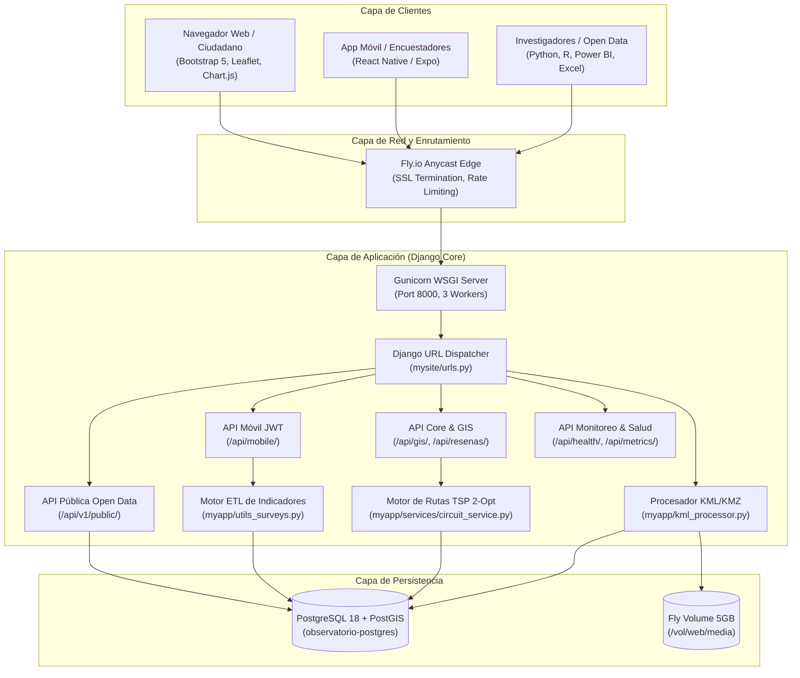
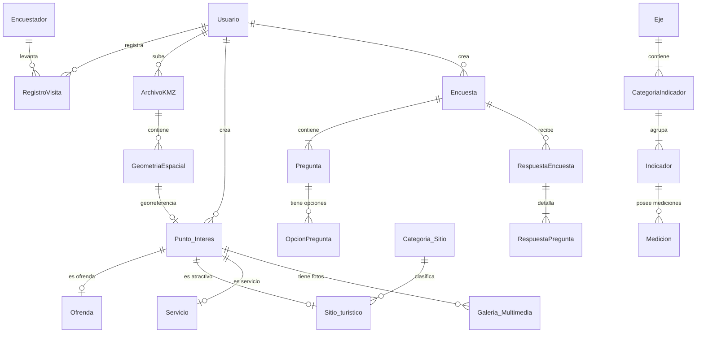
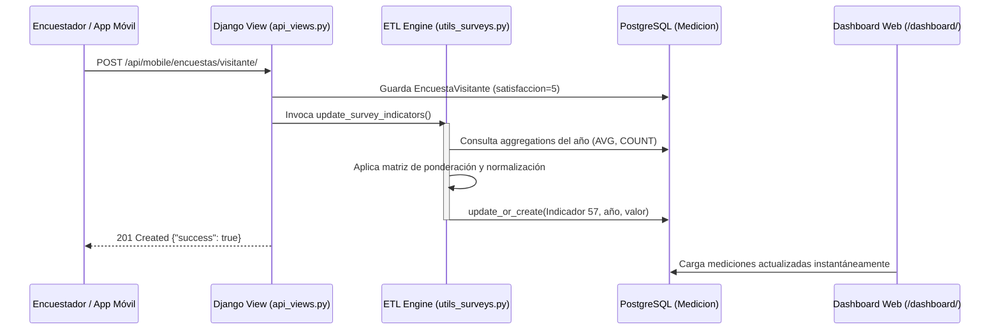
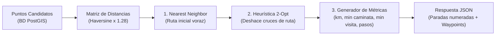

# 📘 Manual Técnico de Arquitectura de Datos, Pipeline ETL y Catálogo de APIs REST
### Observatorio de Datos Turísticos, Culturales y Sociales de Huaquechula, Puebla
**Versión:** 2.1 (Producción)  
**Fecha de Emisión:** Septiembre 2026  
**Entorno de Despliegue:** Fly.io (Dallas DFW / PaaS Container Engine)  
**URL de Producción:** [https://observatorio-huaquechula.fly.dev/](https://observatorio-huaquechula.fly.dev/)  
**Documentación OpenAPI / Swagger:** [https://observatorio-huaquechula.fly.dev/api/docs/](https://observatorio-huaquechula.fly.dev/api/docs/)  
**Documentación ReDoc:** [https://observatorio-huaquechula.fly.dev/api/redoc/](https://observatorio-huaquechula.fly.dev/api/redoc/)

---

## 📑 Tabla de Contenidos
1. [Introducción y Ficha Técnica del Sistema](#1-introducción-y-ficha-técnica-del-sistema)
2. [Arquitectura General del Sistema (Diagramas C4 y Flujo)](#2-arquitectura-general-del-sistema)
3. [Diccionario de Datos y Modelo Entidad-Relación](#3-diccionario-de-datos-y-modelo-entidad-relación)
4. [Motor ETL y Pipeline de Recálculo de Indicadores (`utils_surveys.py`)](#4-motor-etl-y-pipeline-de-recálculo-de-indicadores)
5. [Catálogo Integral de APIs REST y Servicios Web](#5-catálogo-integral-de-apis-rest-y-servicios-web)
   - [5.1 API Pública Open Data (`/api/v1/public/`)](#51-api-pública-open-data)
   - [5.2 API Móvil para Captura en Campo (`/api/mobile/`)](#52-api-móvil-para-captura-en-campo)
   - [5.3 APIs del Core Web y Análisis Territorial (`/api/`)](#53-apis-del-core-web-y-análisis-territorial)
   - [5.4 API de Observabilidad, Métricas y Alertas](#54-api-de-observabilidad-métricas-y-alertas)
6. [Módulo Algorítmico de Circuitos Turísticos (TSP 2-Opt)](#6-módulo-algorítmico-de-circuitos-turísticos-tsp-2-opt)
7. [Políticas de Seguridad, Rate Limiting y Alta Concurrencia](#7-políticas-de-seguridad-rate-limiting-y-alta-concurrencia)

---

## 1. Introducción y Ficha Técnica del Sistema

El **Observatorio de Datos de Huaquechula** es una plataforma tecnológica integral diseñada para recopilar, normalizar, analizar y difundir indicadores sociodemográficos, dinámica turística y métricas de salvaguardia del Patrimonio Cultural Inmaterial (PCI) centrado en las tradicionales **Ofrendas Monumentales de Día de Muertos**.

```
┌────────────────────────────────────────────────────────────────────────┐
│                        FICHA TÉCNICA DEL STACK                         │
├───────────────────────┬────────────────────────────────────────────────┤
│ Lenguaje y Versión    │ Python 3.11-slim (Contenedor Dockerizado)     │
│ Framework Web         │ Django 5.2 con Django REST Framework (DRF)     │
│ Documentación API     │ drf-spectacular (OpenAPI 3.0 / Swagger UI)     │
│ Motor de Base de Datos│ PostgreSQL 18 con extensiones PostGIS 3.6      │
│ Servidor WSGI         │ Gunicorn con 3 Workers síncronos               │
│ Almacenamiento Media  │ Fly Volumes (5 GB persistente en /vol/web)     │
│ Cartografía Web       │ Leaflet 1.9.4 + Leaflet Routing Machine        │
│ Algoritmo de Rutas    │ Heurística TSP 2-Opt en Python puro (<5 ms)    │
│ Visualización Datos   │ Chart.js 3.9 + JSON-stat compatible            │
│ Infraestructura Cloud │ Fly.io (1 Shared CPU, 1024 MB RAM, DFW)        │
└───────────────────────┴────────────────────────────────────────────────┘
```

---

## 2. Arquitectura General del Sistema

El sistema implementa una arquitectura modular multicapa orientada a servicios:



---

## 3. Diccionario de Datos y Modelo Entidad-Relación

La base de datos relacional modela 6 subsistemas acoplados mediante integridad referencial estricta:



### 3.1 Modelos Principales

#### `Usuario` (Modelo personalizado `myapp.Usuario`)
Extiende `AbstractBaseUser` y `PermissionsMixin`.
- `id` (PK, AutoField).
- `nombre_usuario` (VARCHAR 50, UNIQUE): Identificador de login.
- `email` (VARCHAR 254, UNIQUE): Correo de autenticación y notificaciones.
- `tipo` (VARCHAR 20): Roles del sistema: `'admin'`, `'encuestador'`, `'turista'`, `'propietario'`.
- `is_staff`, `is_superuser`, `is_active` (BOOLEAN): Banderas administrativas.

#### `Indicador` y `Medicion` (Núcleo Estadístico del Observatorio)
- **`Indicador`**:
  - `id` (PK, IntegerField): ID semántico compatible con el catálogo metodológico (1 al 63).
  - `categoria` (FK `CategoriaIndicador`): Eje temático (Economía, Cultura, PCI, Demografía).
  - `nombre` (VARCHAR 255): Título descriptivo del indicador.
  - `unidad_medida` (VARCHAR 50): Ej. `"Porcentaje"`, `"Visitantes"`, `"Escala 1 a 5"`.
  - `codigo_inegi` (VARCHAR 50, opcional): Clave de indicador en el API del INEGI.
- **`Medicion`**:
  - `id` (PK, AutoField).
  - `indicador` (FK `Indicador`): Indicador al que pertenece.
  - `periodo` (VARCHAR 20): Año o etiqueta temporal (ej. `"2024"`, `"2025"`, `"2026"`).
  - `valor` (DECIMAL 18, 4): Cifra cuantitativa calculada.
  - `fecha_registro` (DATETIME): Momento de inserción/actualización.

#### `GeometriaEspacial` y `Punto_Interes` (Infraestructura GIS)
- **`GeometriaEspacial`**:
  - `id_geometria` (PK, AutoField).
  - `id_archivo` (FK `ArchivoKMZ`, opcional): Archivo KML origen.
  - `nombre` (VARCHAR 255): Nombre del vector geográfico.
  - `tipo` (VARCHAR 20): `'punto'`, `'linea'`, `'poligono'`, `'multipoligono'`.
  - `coordenadas` (JSONField): GeoJSON estándar `[longitud, latitud]` o lista de vértices.
  - `propiedades` (JSONField): Metadatos KML extendidos (`Nom_ánima`, `Dirección`).
- **`Punto_Interes`**:
  - `id_punto` (PK, AutoField).
  - `id_geometria` (FK `GeometriaEspacial`): Vínculo geoespacial.
  - `categoria` (VARCHAR 20): `'ofrenda'`, `'sitio_turistico'`, `'servicio'`, `'evento'`.
  - `nombre` (VARCHAR 100): Nombre público.
  - `descripcion` (TEXT): Reseña histórica o narrativa.
  - `estado` (VARCHAR 10): `'activo'`, `'inactivo'`.
  - `imagen_portada` (VARCHAR 500): URL local o externa de portada.
  - `hora_apertura` / `hora_cierre` (TIME): Horario de visita.

#### Sub-tablas Especializadas
- **`Ofrenda`**: `id_ofrenda` (PK), `id_punto` (OneToOne `Punto_Interes`), `anfitrion` (VARCHAR 100: persona o familia a quien se dedica el altar).
- **`Sitio_turistico`**: `id_sitio` (PK), `id_punto` (OneToOne `Punto_Interes`), `id_categoria` (FK `Categoria_Sitio`), `reglas_acceso` (TEXT).
- **`Servicio`**: `id_servicio` (PK), `id_punto` (OneToOne `Punto_Interes`), `tipo_servicio` (`'cajero'`, `'hospedaje'`, `'modulo'`, `'salud'`), `contacto` (VARCHAR 100).
- **`ResenaGlobal`**: `id` (PK), `calificacion` (SMALLINT 1-5), `nombre_visitante` (VARCHAR 80), `comentario` (TEXT), `estado` (`'pendiente'`, `'publicada'`, `'rechazada'`), `likes` (INTEGER).

---

## 4. Motor ETL y Pipeline de Recálculo de Indicadores

El archivo [`myapp/utils_surveys.py`](file:///C:/Users/BORRE117/Downloads/Huaquechula%20P/Observatorio-de-Datos-Huaquechula/myapp/utils_surveys.py) orquesta la extracción, transformación y carga automática cada vez que se envía una encuesta desde la aplicación móvil o el portal web.



### 4.1 Mapeos de Ponderación Estadística en `utils_surveys.py`

| ID Indicador | Nombre del Indicador | Variable Fuente | Mapeo Ordinal / Fórmula | Rango Resultado |
|:---:|---|---|---|:---:|
| **34** | Tensión sobre la población | `tension_festividades` | Promedio aritmético directo ($1.0$ a $4.0$) | $1.0 - 4.0$ |
| **35** | Acceso a servicios públicos | `acceso_servicios_festividades` | Excelente $\rightarrow 100\%$, Regular $\rightarrow 50\%$, Deficiente $\rightarrow 0\%$ | $0.0 - 100.0\%$ |
| **36** | Pérdida de la tradición | `perdida_tradicion` | Escala Likert de afectación comunitaria | $1.0 - 3.0$ |
| **37** | Salvaguardia comunitaria | `participacion_preservacion` | Activa $\rightarrow 3.0$, Apoyo $\rightarrow 2.0$, Ninguna $\rightarrow 1.0$ | $1.0 - 3.0$ |
| **40** | Relevo generacional en PCI | `interes_jovenes` | Activa $\rightarrow 5.0$, Parcial $\rightarrow 3.0$, Perdiendo $\rightarrow 1.0$ | $1.0 - 5.0$ |
| **41** | Gobernanza participativa | `participacion_decisiones` | Regular $\rightarrow 100\%$, Parcial $\rightarrow 50\%$, Nunca $\rightarrow 0\%$ | $0.0 - 100.0\%$ |
| **42** | Capacitación turística | `capacitacion_turistica` | Continua $\rightarrow 5.0$, Aislada $\rightarrow 3.0$, Ninguna $\rightarrow 1.0$ | $1.0 - 5.0$ |
| **45** | Beneficio económico local | `beneficio_economico` | Conteo de residentes con beneficio comercial directo | Entero $\ge 0$ |
| **55** | Afluencia en festividades | `visitantes_festividades` | Conteo reportado en censo institucional | Personas |
| **57** | Índice de satisfacción | `satisfaccion` | Media aritmética de calificaciones recibidas ($1-5$) | $1.0 - 5.0$ ⭐ |

---

## 5. Catálogo Integral de APIs REST y Servicios Web

### 5.1 API Pública Open Data (`/api/v1/public/`)
*Diseñada para investigadores, observatorios pares, estudiantes y desarrolladores cívicos. Sin autenticación requerida, respuestas JSON en formato REST estándar.*

#### Grupo 1: Indicadores Territoriales
- **`GET /api/v1/public/ejes/`**: Lista los 4 ejes macro del Observatorio (Social, Económico, Cultural, Ambiental).
- **`GET /api/v1/public/categorias/`**: Lista las subcategorías con conteo de indicadores activos.
- **`GET /api/v1/public/indicadores/`**: Listado maestro paginado de los 63 indicadores.
  - *Query Params:* `?categoria=id`, `?search=texto`, `?page=1`
- **`GET /api/v1/public/indicadores/<id>/`**: Ficha técnica completa del indicador, fuente, unidad y semáforo.
- **`GET /api/v1/public/indicadores/<id>/serie/`**: Serie histórica cronológica anual de mediciones (`[{"periodo": "2024", "valor": 4.5}, ...]`).
- **`GET /api/v1/public/indicadores/<id>/ultima/`**: Última medición registrada con timestamp.
- **`GET /api/v1/public/indicadores/<id>/jsonstat/`**: Cubo de datos multidimensional en formato internacional **JSON-stat v2.0** para integración con herramientas estadísticas (R, Python pandas, INEGI).

#### Grupo 2: Turismo y Afluencia Agregada (Anonimizada)
- **`GET /api/v1/public/turismo/resumen/`**: KPIs generales del año (total visitantes, porcentaje de foráneos, satisfacción promedio).
- **`GET /api/v1/public/turismo/visitantes-por-mes/`**: Distribución mensual de afluencia para análisis de estacionalidad.
- **`GET /api/v1/public/turismo/procedencias/`**: Top 10 de estados de la república y países de origen de los visitantes.
- **`GET /api/v1/public/turismo/perfil-demografico/`**: Distribución etaria agregada (hombres y mujeres por grupos de edad).
- **`GET /api/v1/public/turismo/transporte/`**: Distribución modal de llegada (automóvil propio, autobús foráneo, transporte público, bicicleta).
- **`GET /api/v1/public/turismo/estancia/`**: Tiempo promedio de permanencia en el municipio (excursionistas vs. pernocta).

#### Grupo 3: Territorio y Recursos Geoespaciales
- **`GET /api/v1/public/puntos-interes/`**: FeatureCollection GeoJSON con todos los puntos y polígonos activos.
- **`GET /api/v1/public/ofrendas/`**: GeoJSON filtrado con los altares monumentales y nombres de anfitriones.
- **`GET /api/v1/public/sitios-turisticos/`**: GeoJSON de templos, museos y atractivos arquitectónicos.
- **`GET /api/v1/public/rutas/`**: Vectores LineString de corredores peatonales tradicionales.

#### Grupo 4: Reseñas y Percepción Ciudadana
- **`GET /api/v1/public/resenas/`**: Feed público de reseñas verificadas y aprobadas.
- **`GET /api/v1/public/resenas/estadisticas/`**: Puntuación general (1-5), número de opiniones y desglose por estrellas.

---

### 5.2 API Móvil para Captura en Campo (`/api/mobile/`)
*Optimizada para la aplicación de encuestadores de campo (`ObservatorioMovil`), con soporte offline/online y autenticación JWT.*

- **`POST /api/mobile/login/`**:
  - *Payload:* `{"nombre_usuario": "kevin", "password": "..."}`
  - *Response:* `{"access": "eyJhbGciOi...", "refresh": "eyJhbG...", "user": {"id": 2, "nombre": "Kevin", "tipo": "encuestador"}}`
- **`POST /api/mobile/token/refresh/`**: Renovación de token de sesión expirado.
- **`GET /api/mobile/perfil/`**: Datos del usuario autenticado, roles y estadísticas de captura.
- **`POST /api/mobile/visitas/`**: Registro rápido de afluencia por grupos demográficos en accesos principales.
- **`POST /api/mobile/encuestas/visitante/`**: Ingesta del instrumento de visitante (motivo, gasto, satisfacción).
- **`POST /api/mobile/encuestas/residente/`**: Ingesta del instrumento de residente (impacto comunitario, agua, vialidad).
- **`POST /api/mobile/encuestas/institucional/`**: Censo institucional con autoridades locales y mayordomías.
- **`POST /api/mobile/encuestas/comercio/`**: Captura de derrama y ventas del comercio local.
- **`GET /api/mobile/encuestas-creadas/`**: Sincronización de formularios dinámicos creados por el administrador.
- **`POST /api/mobile/encuestas-creadas/<id>/responder/`**: Envío de respuestas a formularios dinámicos.

---

### 5.3 APIs del Core Web y Análisis Territorial (`/api/`)

#### 🗺️ Circuitos Turísticos Automáticos (`/api/gis/circuito-turistico/`)
Calcula el recorrido peatonal matemáticamente óptimo utilizando TSP 2-Opt.

- **Método:** `GET` o `POST`
- **Parámetros:**
  - `categoria` (string): `'ofrenda'`, `'sitio_turistico'`, `'todos'`. Default: `'ofrenda'`.
  - `circuito_cerrado` (bool): `true` (regresa al inicio) o `false`. Default: `true`.
  - `origen_lat` / `origen_lng` (float, opcional): Coordenadas GPS del usuario. Si se omiten, toma el Zócalo (`18.769895, -98.544040`).
  - `max_paradas` (int): Límite de puntos (default: 15).
- **Ejemplo de Respuesta Exitosa (`200 OK`):**
```json
{
  "status": "success",
  "categoria": "ofrenda",
  "resumen": {
    "total_paradas": 5,
    "distancia_total_m": 1451.6,
    "distancia_total_km": 1.45,
    "tiempo_caminata_min": 21,
    "tiempo_estancia_min": 75,
    "tiempo_total_min": 96,
    "tiempo_total_formato": "1h 36m",
    "pasos_estimados": 1935,
    "circuito_cerrado": true,
    "origen_lat": 18.769895,
    "origen_lng": -98.54404
  },
  "paradas": [
    {
      "orden": 0,
      "es_origen": true,
      "id_punto": 0,
      "nombre": "Zócalo de Huaquechula",
      "categoria_display": "Punto de Partida",
      "lat": 18.769895,
      "lng": -98.54404,
      "distancia_siguiente_m": 101.3,
      "tiempo_siguiente_min": 2
    },
    {
      "orden": 1,
      "es_origen": false,
      "id_punto": 5,
      "nombre": "Ofrenda Monumental Familia Soriano",
      "anfitrion": "Don Manuel Soriano",
      "lat": 18.7694,
      "lng": -98.5435,
      "distancia_siguiente_m": 239.9,
      "tiempo_siguiente_min": 4
    }
  ],
  "waypoints": [
    [18.769895, -98.54404],
    [18.7694, -98.5435],
    [18.769895, -98.54404]
  ]
}
```

#### 🌟 Reseñas Ciudadanas (`/api/resenas/`)
- **`GET /api/resenas/`**: Obtiene lista paginada de opiniones públicas y distribución de estrellas.
- **`POST /api/resenas/`**: Registra nueva opinión ciudadana.
  - *Payload:* `{"calificacion": 5, "nombre_visitante": "Turista CDMX", "comentario": "Increíble tradición...", "recaptcha_token": "..."}`
  - *Protección:* Valida reCAPTCHA v2 y evalúa toxicidad con moderador.
- **`POST /api/resenas/<id>/like/`**: Incrementa el contador de aprobación de una reseña.
- **`POST /api/resenas/<id>/reportar/`**: Bandera ciudadana de contenido inapropiado para revisión de moderación.

#### 📊 Gráficos y Comparativa Municipal
- **`GET /api/indicator/<id>/chart-data/`**: Carga el payload estructurado para visualizaciones interactivas Chart.js.
- **`GET /api/compare-municipalities/`**: Compara indicadores clave de Huaquechula contra municipios vecinos (Atlixco, Izúcar de Matamoros, San Diego la Mesa Tochimiltzingo).

#### 🤖 Asistente Virtual con IA (`/api/chatbot/`)
- **`POST /api/chatbot/`**: Responde dudas turísticas sobre horarios de templos, historia del Ex-Convento y ubicación de altares monumentales basándose en el contexto validado del Observatorio.

---

### 5.4 API de Observabilidad, Métricas y Alertas

Diseñada para monitorizar la salud del contenedor en Fly.io y la fiabilidad de los datos en tiempo real:

- **`GET /api/health/`**:
  - Sondeo de salud utilizado por Fly.io y monitores de uptime.
  - Valida la conectividad directa con PostgreSQL mediante `SELECT 1` y calcula la latencia interna en milisegundos.
  - *Respuesta:* `{"status": "healthy", "database": "connected", "latency_ms": 14.2, "service": "Observatorio Huaquechula Core API"}`
- **`GET /api/metrics/`**:
  - Exportador compatible con **Prometheus / Grafana**.
  - Publica contadores de encuestas por tipo, latencia de base de datos y total de visitas registradas.
- **`GET /api/monitoring/survey-flow/`**:
  - Auditoría del estado de sincronización entre encuestas móviles y actualización de mediciones en la web.
- **`GET /api/monitoring/live-stream/`**:
  - Canal **Server-Sent Events (SSE)** en tiempo real que transmite eventos a la pantalla de monitoreo (`/monitoreo/en-vivo/`).
- **`POST /api/monitoring/test-alert/`**:
  - Disparador de prueba de notificación a WhatsApp vía webhook para alertas operativas críticas.

---

## 6. Módulo Algorítmico de Circuitos Turísticos (TSP 2-Opt)

El cálculo del circuito óptimo resuelve el **Problema del Agente Viajero (TSP)** sin sobrecargar el servidor de base de datos PostgreSQL:



### Principios del Algoritmo:
1. **Distancia Geodésica Haversine**:
   Calcula la distancia de círculo máximo sobre el elipsoide WGS84 entre dos coordenadas $(\phi_1, \lambda_1)$ y $(\phi_2, \lambda_2)$:
   $$a = \sin^2\left(\frac{\Delta \phi}{2}\right) + \cos(\phi_1)\cos(\phi_2)\sin^2\left(\frac{\Delta \lambda}{2}\right)$$
   $$d = 2 R \cdot \operatorname{atan2}\left(\sqrt{a}, \sqrt{1-a}\right)$$
2. **Factor de Sinuosidad Urbana ($1.28\times$)**:
   Las calles coloniales peatonales de Huaquechula no son líneas rectas euclidianas. El factor empírico de $1.28$ aproxima la distancia real por la traza urbana sin necesidad de realizar costosas consultas a grafos topológicos pesados en la base de datos.
3. **Optimización Local 2-Opt**:
   Itera invirtiendo subsecuencias de paradas $[i, j]$ si y solo si la permutación reduce la distancia euclidiana total del trayecto:
   $$\Delta \text{dist} = (d_{i-1, j} + d_{i, j+1}) - (d_{i-1, i} + d_{j, j+1}) < 0$$
   Garantiza que la línea de recorrido nunca se cruce sobre sí misma.
4. **Estimación de Pasos y Tiempo de Permanencia**:
   - Velocidad turística: $4.2 \text{ km/h} \approx 70 \text{ m/min}$.
   - Tiempo de visita por parada: $15 \text{ min}$ sugeridos por altar monumental o capilla.
   - Longitud de zancada promedio: $0.75 \text{ metros/paso}$.

---

## 7. Políticas de Seguridad, Rate Limiting y Alta Concurrencia

### 7.1 Seguridad
1. **Protección CSRF**: Todas las peticiones web mutables (`POST`, `PUT`, `DELETE`) exigen el token `X-CSRFToken` inyectado por Django.
2. **Protección reCAPTCHA v2**: El endpoint de reseñas públicas `/api/resenas/` requiere verificación obligatoria de token de Google reCAPTCHA antes de persistir datos en la base.
3. **Consultas Parametrizadas**: El uso del ORM de Django en el 100% de las consultas elimina vulnerabilidades de Inyección SQL.
4. **Headers HTTP Endurecidos**:
   - `X-Content-Type-Options: nosniff`
   - `X-Frame-Options: SAMEORIGIN` (evita ataques de Clickjacking)
   - `Strict-Transport-Security` forzado vía proxy Fly.io.

### 7.2 Capacidad de Concurrencia y Escalabilidad
- **Capacidad con 1 Máquina en Fly.io**: Entre **2,000 y 3,500 usuarios activos simultáneos** recorriendo Huaquechula, gracias a que el cálculo de rutas se resuelve en $\approx 25\text{ ms}$ y la navegación gráfica ocurre en el cliente Leaflet.
- **Preparación para Día de Muertos (Alta Demanda 1 y 2 de Noviembre)**:
  - Activar workers multihilo en `entrypoint.prod.sh`: `--workers 3 --threads 4`.
  - Escalar a 2 instancias gemelas con un solo comando:
    ```bash
    fly scale count 2
    ```

---

## 8. Verificación y Pruebas Automatizadas

El proyecto cuenta con un conjunto de pruebas automatizadas en [`myapp/tests.py`](file:///C:/Users/BORRE117/Downloads/Huaquechula%20P/Observatorio-de-Datos-Huaquechula/myapp/tests.py) que validan:
1. Creación y llenado dinámico de encuestas.
2. Algoritmo de optimización TSP 2-Opt (ordenamiento y no cruce de aristas).
3. Disponibilidad y formato del endpoint `/api/gis/circuito-turistico/`.

Para ejecutar las pruebas en local o entorno CI/CD:
```bash
python manage.py test myapp.tests.CircuitosTuristicosTestCase
```
