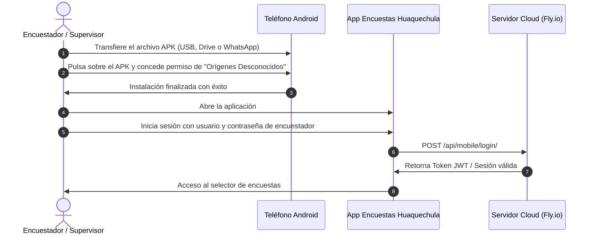

# Encuestas Móviles — Observatorio Territorial Huaquechula
## Guía Oficial de Instalación, Operación y Desarrollo

[](https://reactnative.dev/)
[](https://expo.dev/)
[](https://www.android.com/)
[](https://observatorio-huaquechula.fly.dev)
[]()

> **Aplicación Móvil Oficial para Brigadas y Encuestadores de Campo del Observatorio de Datos e Inteligencia Territorial de Huaquechula, Puebla.**

---

## 📱 Descripción General

**Encuestas Móviles Huaquechula** es una aplicación nativa multiplataforma (enfocada primordialmente en Android) desarrollada con **React Native y Expo**, diseñada para que los encuestadores del H. Ayuntamiento levanten información socioeconómica, de afluencia turística y percepción ciudadana de forma ágil y confiable durante las festividades de **Todos Santos** y a lo largo de todo el año.

### Características Clave
- **Arquitectura Offline-First:** Las encuestas capturadas se guardan de inmediato en el almacenamiento local del teléfono (`AsyncStorage`). Si se pierde la señal celular (3G/4G/5G) en juntas auxiliares o zonas de alta concurrencia, los datos quedan protegidos en una cola local (`offlineQueue.js`) y se sincronizan automáticamente tan pronto se recupera la conexión.
- **Selector de Procedencia Inteligente en Cascada:** Componente dinámico (`SelectorProcedencia.js`) que precarga los 32 estados de México y sus principales municipios, con opción abierta ("Otro") y soporte para visitantes internacionales (EE. UU., Canadá, Europa, etc.).
- **5 Módulos de Captura Integrados:**
  1. 🚶 **Registro Rápido de Afluencia:** Aforo en accesos, distribución de grupo por género y 4 rangos de edad.
  2. 🧳 **Perfil del Visitante:** Gasto promedio, estancia, alojamiento y motivo de viaje.
  3. 🏡 **Residente Local:** Impacto sociocultural y beneficio percibido del turismo comunitario.
  4. 🏛️ **Autoridades / Institucional:** Evaluación de infraestructura y coordinación de servicios.
  5. 🏪 **Comercio y Prestadores:** Ventas, derrama económica, insumos y empleo local.
- **Soporte para Encuestas Dinámicas:** Descarga y despliega en tiempo real las encuestas personalizadas creadas desde la plataforma web del Observatorio.
- **Panel Personal del Encuestador:** Contador de encuestas levantadas en la jornada y semáforo de sincronización en tiempo real.

---

## 📦 Instalación Rápida del APK (Para Encuestadores y Supervisores)

El repositorio incluye el instalador binario compilado listo para su despliegue inmediato en teléfonos Android:

📁 **Archivo:** [`ObservatorioMovil/EncuestasMoviles-Huaquechula-v1.0.2.apk`](file:///C:/Users/BORRE117/Downloads/Huaquechula%20P/Observatorio-de-Datos-Huaquechula/ObservatorioMovil/EncuestasMoviles-Huaquechula-v1.0.2.apk)  
- **Versión:** 1.0.2 (Código de versión: 3)
- **Identificador de paquete:** `com.observatorio.huaquechula`
- **Compatibilidad:** Android 8.0 (Oreo) o superior

### Pasos para Instalar en el Celular



1. **Copiar el APK al dispositivo:**
   - Puede transferir el archivo `EncuestasMoviles-Huaquechula-v1.0.2.apk` mediante cable USB, enviarlo por WhatsApp / Telegram, o descargarlo desde Google Drive.
2. **Habilitar Fuentes Desconocidas:**
   - Al abrir el archivo en el teléfono, Android solicitará permiso para **"Instalar aplicaciones de fuentes desconocidas"** desde el navegador o explorador de archivos. Presione **"Permitir"**.
3. **Completar la instalación:**
   - Presione **"Instalar"** y, al finalizar, pulse **"Abrir"**.
4. **Inicio de Sesión:**
   - Ingrese con sus credenciales de encuestador (ej. `tutor1`, `tutor2` o el usuario asignado por el Administrador municipal).

---

## 🛠️ Entorno de Desarrollo y Ejecución Local

Si requiere modificar las pantallas, añadir preguntas o probar nuevas funciones, siga estos pasos:

### 1. Requisitos Previos
- **Node.js:** Versión 18.x o superior ([nodejs.org](https://nodejs.org/))
- **Gestor de paquetes:** `npm` (incluido con Node.js)
- **Expo CLI:** Se ejecuta automáticamente mediante `npx expo`
- **Dispositivo de prueba:**
  - Teléfono físico con la app **Expo Go** instalada (disponible en Google Play Store y Apple App Store), o
  - Emulador de Android configurado en Android Studio.

### 2. Instalación de Dependencias
Abra su terminal en la carpeta `ObservatorioMovil`:
```bash
cd "C:\Users\BORRE117\Downloads\Huaquechula P\Observatorio-de-Datos-Huaquechula\ObservatorioMovil"
npm install
```

### 3. Configuración del Servidor Backend (`src/services/api.js`)
Por defecto, la aplicación móvil está configurada para conectarse al servidor de **producción en Fly.io**:

```javascript
// src/services/api.js
const PRODUCTION_URL = 'https://observatorio-huaquechula.fly.dev';
```

Si desea probar contra un servidor Django ejecutándose localmente en su computadora:
1. Abra `src/services/api.js`.
2. Modifique la constante `WIFI_IP` con la dirección IP local de su computadora (ej. `192.168.1.65`):
   ```javascript
   const WIFI_IP = '192.168.1.65'; // Su IP local
   ```
3. Asegúrese de que su teléfono móvil y su computadora estén conectados a la **misma red Wi-Fi**.

### 4. Iniciar el Servidor de Desarrollo Metro
```bash
npm start
# o bien:
npx expo start
```

- **En Teléfono Físico:** Abra la aplicación **Expo Go**, seleccione "Scan QR Code" y escanee el código que aparece en la terminal.
- **En Emulador Android:** Presione la tecla `a` en la terminal.
- **En Navegador Web:** Presione la tecla `w` en la terminal.

---

## 🏗️ Estructura del Código Fuente

```
ObservatorioMovil/
├── assets/                     # Iconos, splash screens y recursos visuales
├── src/
│   ├── components/             # Componentes visuales reutilizables
│   │   └── SelectorProcedencia.js  # Selector en cascada País -> Estado -> Ciudad
│   ├── constants/              # Constantes globales
│   │   └── geoData.js          # Catálogo precargado de estados y municipios de México
│   ├── context/                # Manejo de estado global con React Context
│   │   └── AuthContext.js      # Sesión de usuario, tokens y estado de autenticación
│   ├── navigation/             # Enrutamiento de pantallas
│   │   └── AppNavigator.js     # Stacks y Bottom Tab Navigator
│   ├── screens/                # Vistas de la aplicación
│   │   ├── LoginScreen.js          # Pantalla de acceso
│   │   ├── DashboardScreen.js      # Resumen operativo del encuestador
│   │   ├── SelectorEncuestasScreen.js # Menú de selección de cuestionarios
│   │   ├── FormularioVisitaScreen.js  # Formulario rápido de afluencia
│   │   ├── EncuestaVisitanteScreen.js # Cuestionario de perfil turístico
│   │   ├── EncuestaResidenteScreen.js # Cuestionario a población local
│   │   ├── EncuestaInstitucionalScreen.js # Cuestionario a autoridades
│   │   ├── EncuestaComercioScreen.js      # Cuestionario a negocios locales
│   │   ├── DynamicSurveyScreen.js    # Renderizador de encuestas dinámicas
│   │   ├── MisVisitasScreen.js       # Historial de aforos del brigadista
│   │   ├── MisEncuestasScreen.js     # Historial de encuestas aplicadas
│   │   └── IndicadoresScreen.js      # Consulta móvil de indicadores clave
│   └── services/               # Conectores de red y almacenamiento
│       ├── api.js              # Cliente Axios con interceptores de Token y Timeouts
│       ├── authService.js      # Autenticación y gestión de sesión
│       ├── storage.js          # Wrapper de AsyncStorage seguro
│       ├── offlineQueue.js     # Cola de sincronización fuera de línea
│       ├── visitasService.js   # Endpoints de afluencia
│       ├── encuestasService.js # Endpoints de encuestas
│       └── indicadoresService.js # Endpoints de métricas agregadas
├── App.js                      # Punto de entrada de la aplicación
├── app.json                    # Manifiesto y configuración de Expo / Android
├── eas.json                    # Configuración de compilación con EAS Build
└── EncuestasMoviles-Huaquechula-v1.0.2.apk  # Binario instalable Android
```

---

## 🚀 Compilación de Nuevas Versiones con Expo EAS Build

Para generar un nuevo instalador APK de distribución interna o producción sin necesidad de configurar Android Studio:

1. **Instalar EAS CLI (si no lo tiene):**
   ```bash
   npm install -g eas-cli
   ```
2. **Iniciar sesión en su cuenta de Expo:**
   ```bash
   eas login
   ```
3. **Generar un nuevo APK para Android:**
   ```bash
   eas build -p android --profile preview
   ```
   *EAS compilará el proyecto en la nube y le entregará un enlace directo de descarga para el nuevo archivo `.apk`.*

---

## ❓ Preguntas Frecuentes y Resolución de Problemas

#### 1. ¿Qué ocurre si el encuestador se queda sin datos móviles en medio de una encuesta?
La aplicación está programada para guardar la respuesta íntegramente en la memoria del teléfono. Aparecerá un aviso que indica: *"Encuesta guardada localmente (Modo sin conexión)"*. En cuanto el dispositivo detecte señal de red, el servicio `offlineQueue.js` enviará las encuestas pendientes al servidor sin duplicar registros.

#### 2. La aplicación muestra "Error de conexión con el servidor" al iniciar sesión
- Verifique que el dispositivo tenga acceso a internet.
- Confirme que el servidor central en producción esté activo visitando [https://observatorio-huaquechula.fly.dev/api/health/](https://observatorio-huaquechula.fly.dev/api/health/) desde el navegador del celular.
- Si está en desarrollo local, confirme que el teléfono y la computadora compartan la misma red Wi-Fi y que el firewall de Windows no bloquee el puerto 8000.

#### 3. ¿Cómo cierro sesión para cambiar de encuestador en el mismo teléfono?
En la pestaña de **Perfil / Configuración**, presione el botón **"Cerrar Sesión"**. Esto limpiará el token de seguridad y devolverá al usuario a la pantalla de Login, permitiendo que otro brigadista ingrese con su cuenta.

---

*H. Ayuntamiento de Huaquechula, Puebla — Dirección de Tecnologías de la Información y Dirección de Turismo.*
