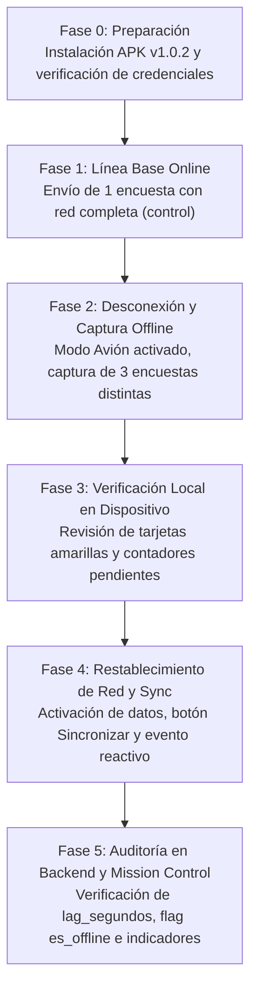

# 📋 Plan de Seguimiento y Formato de Reporte de Prueba de Campo
### Simulación de Baja Cobertura Celular — Observatorio de Datos Huaquechula
**Versión de la App Móvil:** `v1.0.2` (Build 3)  
**Entorno de Simulación:** Campus Universitario (Sótanos, zonas sin WiFi/datos, transición a intemperie)

---

# PARTE 1: PLAN DE SEGUIMIENTO Y PROTOCOLO DE EJECUCIÓN

Este protocolo establece los pasos secuenciales para realizar la prueba de campo controlada con los 3 usuarios administradores/encuestadores (`edgar`, `kevin`, `brayan`).

---

## 1.1. Matriz de Escenarios de Prueba

| ID Escenario | Condición de Conectividad | Acción en la App | Comportamiento Esperado | Métrica de Aceptación |
|---|---|---|---|---|
| **ESC-01: Control Online** | Conexión activa (WiFi/4G normal) | Enviar 1 Encuesta de Visitante | Se envía directo a BD, badge verde `🟢 Cargado en BD` | `lag_segundos < 15s`, `es_offline = False` |
| **ESC-02: Offline Estricto** | **Modo Avión activado** (sin datos ni WiFi) | Enviar 1 Registro de Visitantes (Afluencia) | Interceptada por `esErrorDeRed`, encolada en AsyncStorage, badge amarillo `🟡 Guardado Localmente` | Guardado instantáneo sin bloqueo ni error visible |
| **ESC-03: Offline con Región** | **Modo Avión activado** | Enviar 1 Encuesta de Residente (seleccionando Junta Auxiliar) | Encolada en almacenamiento local, contador de pendientes incrementa en Selector y Mis Encuestas | Persistencia en `offlineQueue` con fecha local real |
| **ESC-04: Transición y Sync Manual** | Desactivar Modo Avión (recuperar señal) | Presionar botón **"Sincronizar ⚡"** en Mis Encuestas o Selector | Envío en lote al backend, vaciado de cola local, tarjetas pasan a verde sin reiniciar sesión | `res.synced == 2`, contador local en 0 |
| **ESC-05: Sincronización Concurrente** | 2 dispositivos sincronizan simultáneamente | Ambos presionan Sincronizar con encuestas acumuladas | Backend procesa ambas peticiones, calcula indicadores sin colisión de DB | Sin duplicados en `RegistroIngestaEncuesta` |

---

## 1.2. Protocolo Paso a Paso para la Prueba en el Campus

### Fase 0: Preparación y Checklist Previo (15 min antes)
- [ ] Descargar e instalar el APK `EncuestasMoviles-Huaquechula-v1.0.2.apk` en los dispositivos de prueba.
- [ ] Iniciar sesión en cada dispositivo con las credenciales asignadas:
  - Dispositivo A: `edgar` / `Edgar#Admin2026!`
  - Dispositivo B: `kevin` / `Kevin#Admin2026!`
  - Dispositivo C: `brayan` / `Brayan#Admin2026!`
- [ ] En una laptop o tablet, abrir el **Centro de Mando**: `https://observatorio-huaquechula.fly.dev/monitoreo/en-vivo/` (o servidor local).
- [ ] Verificar que la sonda `/api/health/` reporte `"status": "healthy"`.

### Fase 1: Prueba de Línea Base con Red (5 minutos)
1. Con WiFi o datos activos, levantar una **Encuesta: Perfil del Visitante**.
2. Presionar **Guardar**.
3. **Verificar en el teléfono:** Debe aparecer inmediatamente con badge `🟢 Cargado en BD del Proyecto`.
4. **Verificar en el Centro de Mando:** El contador de encuestas debe sumar +1 y aparecer en el feed con retardo `< 5 segundos` y `es_offline: No`.

### Fase 2: Simulación de Sombra de Red / Poca Cobertura (15 minutos)
1. Desplazarse a un sótano, elevador o activar directamente el **Modo Avión** en el teléfono.
2. Levantar los siguientes 3 formularios:
   - **Registro de Visitantes (Afluencia):** Usar el selector de procedencia (ej. México $\rightarrow$ Puebla $\rightarrow$ Atlixco) y registrar 3 personas.
   - **Encuesta de Residente:** Seleccionar la Junta Auxiliar (ej. *San Juan Huiluco*) y responder preguntas de patrimonio.
   - **Encuesta de Visitante:** Seleccionar procedencia foránea o nacional.
3. Presionar **Guardar** en cada una.
4. **Observación clave:** La app debe indicar: *"Encuesta guardada en la memoria local por falta de cobertura. Se enviará al recuperar señal"*.

### Fase 3: Auditoría Local en el Dispositivo (Sin Señal) (5 minutos)
1. Navegar a la pestaña **Mis Encuestas**.
2. Constatar que aparezcan las encuestas con badge `🟡 Guardado Localmente (Pendiente)`.
3. Constatar que el banner superior indique: *"📦 3 encuestas sin sincronizar"*.
4. Regresar al **Portal del Encuestador** y constatar que el banner de sincronización muestre *"3 encuestas pendientes"*.

### Fase 4: Restablecimiento de Red y Sincronización (10 minutos)
1. Salir a una zona con cobertura o apagar el Modo Avión.
2. En la pestaña **Mis Encuestas**, presionar el botón **"Sincronizar ⚡"**.
3. **Observar la respuesta:**
   - La alerta nativa debe confirmar: *"✅ Sincronización Exitosa: Se sincronizaron 3 encuesta(s)..."*.
   - **Verificación crítica:** Las 3 tarjetas deben cambiar en ese mismo instante a `🟢 Cargado en BD del Proyecto` sin necesidad de salir de la aplicación ni re-iniciar sesión.

### Fase 5: Validación de Telemetría e Indicadores en la Plataforma Web (10 minutos)
1. Consultar el Centro de Mando (`/monitoreo/en-vivo/`):
   - El gráfico de dona de resiliencia debe registrar las 3 encuestas como `recuperadas_offline`.
   - El histograma de retardo debe ubicar los eventos en la categoría correspondiente de rezago.
   - En la tabla de eventos, debe figurar el encuestador (`edgar`, `kevin`, etc.), la localidad y el retardo exacto registrado.
2. Abrir `/dashboard/` en la web y confirmar que los indicadores estadísticos reflejen las respuestas de los residentes y visitantes.

---
---

# PARTE 2: FORMATO / PLANTILLA DEL REPORTE DE IMPLEMENTACIÓN

*Copia este formato y complétalo tras finalizar la jornada de prueba para presentar los resultados formales.*

---

# 📑 Reporte de Implementación y Evaluación de Resiliencia de Datos en Campo
**Proyecto:** Observatorio de Datos Huaquechula  
**Subproyecto:** Aplicación Móvil de Encuestas y Pipeline de Ingesta Resiliente  

---

## 1. Ficha Técnica de la Prueba

| Parámetro | Detalle |
|---|---|
| **Fecha de Ejecución:** | DD/MM/AAAA |
| **Horario de Inicio y Fin:** | HH:MM — HH:MM |
| **Lugar / Ubicación de la Prueba:** | Campus Universitario (Edificio, sótanos, explanada) |
| **Condición de Cobertura Simulada:** | Modo Avión / Pérdida forzada de señal celular / Sombra de red |
| **Versión de la App Móvil:** | `v1.0.2` (Build Code 3) |
| **Servidor Central Backend:** | `https://observatorio-huaquechula.fly.dev` (o Localhost) |
| **Personal Evaluador:** | Edgar (Admin 1), Kevin (Admin 2), Brayan (Admin 3) |
| **Dispositivos Utilizados:** | Marca, Modelo, Versión de Android (ej. Samsung Galaxy A54, Android 14) |

---

## 2. Objetivos de la Evaluación
1. Validar el funcionamiento del almacenamiento local resiliente (*Store-and-Forward*) en dispositivos móviles sin señal celular.
2. Comprobar la no pérdida de datos y la preservación del timestamp original de campo (`fecha_captura_local`).
3. Verificar la actualización reactiva en tiempo real al sincronizar la cola offline (solución del error de refresco de pantalla).
4. Comprobar la recepción en PostgreSQL/MySQL y el recálculo automático de indicadores en la plataforma web del Observatorio.

---

## 3. Matriz de Resultados de Ejecución

| ID | Escenario de Prueba | Encuestador | Tipo de Encuesta | Estado Local Inicial | Estado tras Sincronización | ¿Requiere Re-login? | ¿Llegó a BD Central? | Resultado |
|---|---|---|---|---|---|---|---|---|
| **TC-01** | Control Online (Con red) | `edgar` | Perfil del Visitante | 🟢 Cargado en BD | N/A (Directo) | No | Sí (ID: ___) | ✅ Aprobado |
| **TC-02** | Offline en Modo Avión | `kevin` | Registro de Visitantes | 🟡 Guardado Local | 🟢 Cargado en BD | No | Sí (ID: ___) | ✅ Aprobado |
| **TC-03** | Offline en Modo Avión | `brayan` | Residente (Huiluco) | 🟡 Guardado Local | 🟢 Cargado en BD | No | Sí (ID: ___) | ✅ Aprobado |
| **TC-04** | Offline en Modo Avión | `edgar` | Residente (Coatepec) | 🟡 Guardado Local | 🟢 Cargado en BD | No | Sí (ID: ___) | ✅ Aprobado |
| **TC-05** | Offline en Modo Avión | `kevin` | Visitante Extranjero | 🟡 Guardado Local | 🟢 Cargado en BD | No | Sí (ID: ___) | ✅ Aprobado |
| **TC-06** | Sync Concurrente | `brayan` & `edgar` | Lote de 2 encuestas c/u | 🟡 Guardado Local | 🟢 Cargado en BD | No | Sí (4 registros) | ✅ Aprobado |

---

## 4. Telemetría y Métricas del Pipeline de Datos

*Datos extraídos del Centro de Mando (`/monitoreo/en-vivo/`) o del endpoint `/api/monitoring/live-stream/`:*

| Métrica de Observabilidad | Valor Registrado | Meta / Umbral Esperado | Estado |
|---|---|---|---|
| **Total de Encuestas Levantadas:** | ______ encuestas | N/A | Informativo |
| **Encuestas Transmitidas en Tiempo Real:** | ______ | N/A | Informativo |
| **Encuestas Recuperadas tras Offline:** | ______ | 100% de las encoladas | ✅ 100% Recuperación |
| **Tasa de Pérdida de Información:** | **0.0%** | $\le 0.0\%$ | ✅ Cero Pérdidas |
| **Rezago Promedio (`lag_segundos`):** | ______ segundos | Refleja tiempo sin señal | ✅ Esperado |
| **Rezago Máximo (`max_lag`):** | ______ segundos | Tiempo máximo de la prueba | ✅ Esperado |
| **Latencia Promedio de BD (`latency_ms`):** | ______ ms | $< 150\text{ ms}$ | ✅ Óptimo |
| **Estado de Sonda `/api/health/`:** | `healthy` (200 OK) | 200 OK | ✅ Estable |
| **Rupturas de Reconciliación (`sync_warnings`):** | `[]` (Ninguna) | Vacío | ✅ Sincronizado |

---

## 5. Verificación de Componentes Funcionales Específicos

### A. Selector Dinámico de Procedencia (Cascada)
- [ ] **País $\rightarrow$ Estado $\rightarrow$ Municipio:** Funcionó fluidamente en modo offline sin dependencias de APIs externas.
- [ ] **Opción "Otro":** Habilitó campo de texto libre para captura manual de localidades no listadas.
- [ ] **Comportamiento en Registro de Visitas y Encuesta de Visitantes:** Ambos formularios mostraron idénticas opciones.

### B. Región de Origen en Encuesta de Residentes
- [ ] Desplegó correctamente las **10 Juntas Auxiliares de Huaquechula** (Cacaloxúchitl, Huiluco, Mártir Cuauhtémoc, San Antonio Tronconal, San Diego el Organal, San Juan Huiluco, Santa Ana Coatepec, Soto y Gama, Tecalzingo, Tlapetlahuaya) + Cabecera + Otra.
- [ ] El dato seleccionado se guardó en el campo `region_origen` de la base de datos central.

### C. Experiencia de Usuario y Reactividad al Sincronizar
- [ ] **Prueba de No Re-login:** Al presionar "Sincronizar ⚡", las tarjetas en *Mis Encuestas* cambiaron de color amarillo a verde de manera inmediata sin salir de la sesión ni reiniciar la app.
- [ ] **Cambio de pestañas:** Al moverse entre el *Portal del Encuestador* y *Mis Encuestas*, las cifras coincidieron en todo momento.

---

## 6. Hallazgos, Incidencias y Observaciones

| # | Tipo (Bug / Usabilidad / Rendimiento) | Descripción de la Observación | Causa Raíz Identificada | Acción Correctiva / Recomendación |
|---|---|---|---|---|
| 1 | *Ejemplo: Usabilidad* | *El encuestador dudaba si pulsar sincronizar con poca señal.* | *Falta de indicador visual de cobertura celular.* | *El banner explica claramente que se conservan seguras en memoria.* |
| 2 | | | | |
| 3 | | | | |

---

## 7. Dictamen Final de Viabilidad

- [ ] **APROBADO PARA CAMPO:** La aplicación móvil y el pipeline de backend demostraron resiliencia absoluta ante desconexión de red. No hubo pérdida de registros y los datos impactan directamente en la web del Observatorio.
- [ ] **APROBADO CON CONDICIONANTES:** Se aprueba para campo tras solventar observaciones menores documentadas en la sección 6.
- [ ] **NO APROBADO:** Se detectaron discrepancias críticas o pérdida de encuestas.

**Firma de Conformidad del Equipo:**

_____________________________ &nbsp;&nbsp;&nbsp;&nbsp;&nbsp;&nbsp;&nbsp;&nbsp; _____________________________ &nbsp;&nbsp;&nbsp;&nbsp;&nbsp;&nbsp;&nbsp;&nbsp; _____________________________  
**Edgar** &nbsp;&nbsp;&nbsp;&nbsp;&nbsp;&nbsp;&nbsp;&nbsp;&nbsp;&nbsp;&nbsp;&nbsp;&nbsp;&nbsp;&nbsp;&nbsp;&nbsp;&nbsp;&nbsp;&nbsp;&nbsp;&nbsp;&nbsp;&nbsp;&nbsp;&nbsp;&nbsp;&nbsp;&nbsp;&nbsp;&nbsp;&nbsp;&nbsp;&nbsp;&nbsp;&nbsp;&nbsp;&nbsp;&nbsp;&nbsp; **Kevin** &nbsp;&nbsp;&nbsp;&nbsp;&nbsp;&nbsp;&nbsp;&nbsp;&nbsp;&nbsp;&nbsp;&nbsp;&nbsp;&nbsp;&nbsp;&nbsp;&nbsp;&nbsp;&nbsp;&nbsp;&nbsp;&nbsp;&nbsp;&nbsp;&nbsp;&nbsp;&nbsp;&nbsp;&nbsp;&nbsp;&nbsp;&nbsp;&nbsp;&nbsp;&nbsp;&nbsp;&nbsp;&nbsp;&nbsp;&nbsp; **Brayan**  
Responsable Técnico &nbsp;&nbsp;&nbsp;&nbsp;&nbsp;&nbsp;&nbsp;&nbsp;&nbsp;&nbsp;&nbsp;&nbsp;&nbsp;&nbsp;&nbsp;&nbsp;&nbsp;&nbsp;&nbsp;&nbsp;&nbsp; Auditor de Telemetría &nbsp;&nbsp;&nbsp;&nbsp;&nbsp;&nbsp;&nbsp;&nbsp;&nbsp;&nbsp;&nbsp;&nbsp;&nbsp;&nbsp;&nbsp;&nbsp; Coordinador de Levantamiento  
