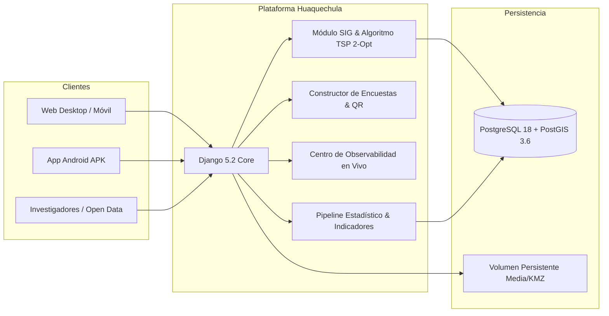

# Observatorio de Datos e Inteligencia Territorial — Huaquechula, Puebla

[](https://www.python.org/)
[](https://www.djangoproject.com/)
[](https://www.postgresql.org/)
[](https://postgis.net/)
[](https://reactnative.dev/)
[](https://expo.dev/)
[](https://fly.io)
[]()

> **Plataforma Integral de Gobernanza de Datos, Salvaguarda Patrimonial y Promoción Turística Inteligente del Municipio de Huaquechula, Puebla.**

🌐 **Entorno en Producción:** [https://observatorio-huaquechula.fly.dev](https://observatorio-huaquechula.fly.dev)  
📖 **Documentación Swagger / OpenAPI:** [https://observatorio-huaquechula.fly.dev/api/docs/](https://observatorio-huaquechula.fly.dev/api/docs/)

---

## 🏛️ Propósito del Proyecto

El **Observatorio de Datos e Inteligencia Territorial de Huaquechula** es una solución tecnológica integral diseñada para el **H. Ayuntamiento de Huaquechula** orientada a:

1. **Monitorear y Evaluar el Impacto Turístico:** Registrar la afluencia de visitantes, el perfil sociodemográfico, la derrama económica estimada y los niveles de satisfacción ciudadana, especialmente durante la temporada de **Todos Santos y sus Ofrendas Monumentales** (Patrimonio Cultural del Estado de Puebla).
2. **Generar Inteligencia Territorial (SIG):** Visualizar cartografía geoespacial detallada, capas KMZ/KML y ofrecer un **Generador Automático de Circuitos Turísticos** con rutas óptimas a pie.
3. **Fomentar la Participación Ciudadana:** Módulo de encuestas dinámicas estilo Google Forms con códigos QR para evaluación de servicios y moderación de reseñas de visitantes.
4. **Garantizar la Gobernanza y Transparencia de Datos:** Catálogo de APIs de datos abiertos, observabilidad del servidor en tiempo real y descarga de reportes ejecutivos en PDF.

---

## 🔑 Credenciales de Prueba y Evaluación (Tutores / Revisores)

Para facilitar la evaluación académica y técnica del sistema en producción, se cuenta con cuentas de acceso con **permisos duales de Administrador y Encuestador**:

| Usuario | Contraseña | Rol / Permisos | Acceso Directo |
| :--- | :--- | :--- | :--- |
| `tutor1` | `Tutor1#Admin2026!` | Superusuario / Administrador + Encuestador | [Iniciar Sesión](https://observatorio-huaquechula.fly.dev/login/) |
| `tutor2` | `Tutor2#Admin2026!` | Superusuario / Administrador + Encuestador | [Iniciar Sesión](https://observatorio-huaquechula.fly.dev/login/) |

*Ambos usuarios tienen acceso completo a la gestión de datos, encuestas, mapas, centro de monitoreo y panel administrativo.*

---

## 🚀 Módulos y Capacidades del Sistema



### 1. 🗺️ Módulo SIG y Circuitos Turísticos Inteligentes
- **Motor de Optimización TSP (2-Opt):** Calcula el orden óptimo de visita entre múltiples puntos de interés (Ofrendas Monumentales, Ex-Convento, Zócalo, cajeros, módulos de auxilio) minimizando la distancia peatonal.
- **Factor de Sinuosidad Urbana (1.28x):** Modela la traza histórica real de calles de Huaquechula para estimar con alta precisión tiempos de caminata a 4 km/h.
- **Experiencia de Usuario Interactiva:** Tarjeta flotante inferior (*bottom-sheet*) con desglose secuencial del itinerario, tiempos y distancias.
- **Procesamiento de Capas KMZ/KML:** Carga, descompresión e ingestión directa de geometrías espaciales a tablas PostGIS.

### 2. 📊 Observatorio Territorial e Indicadores Estratégicos
- **Estructura Tridimensional:** Indicadores agrupados en **Bienestar Social**, **Tradición y Patrimonio**, y **Turismo Sustentable**.
- **Visualización Avanzada:** Sparklines por indicador, cálculo automatizado de tasas de cambio porcentual y semáforos de tendencia.
- **Fichas Técnicas Descargables:** Generación instantánea de reportes ejecutivos en formato PDF con metadatos oficiales (fuentes INEGI y levantamientos municipales).

### 3. 📱 Portal del Encuestador & App Móvil de Campo
- **Portal Web Móvil (`/encuestador/`):** Optimizado para smartphones (360px a 768px), con selectores de procedencia en cascada (País -> Estado -> Municipio), matrices de edad/género y soporte de almacenamiento local ante desconexión.
- **App Móvil Nativa (React Native / Expo):** Disponible en `ObservatorioMovil/` con binario precompilado `EncuestasMoviles-Huaquechula-v1.0.2.apk` para brigadistas en campo.
- **Pipeline ETL Automático (`utils_surveys.py`):** Cada encuesta recalculada actualiza al instante la derrama económica estimada y el índice de satisfacción general.

### 4. 📋 Módulo de Encuestas Dinámicas Personalizadas
- **Creador de Formularios Intuitivo:** Diseñador tipo Google Forms para encuestas de temporada (selección única, casillas, escalas Likert 1-5, texto libre).
- **Generación Automática de Códigos QR:** Descarga de QR en alta resolución para colocar en mesas de atención, restaurantes y módulos turísticos.
- **Publicación al Repositorio:** Con un solo clic, las respuestas tabuladas y sus gráficos se archivan como reporte técnico público en el repositorio municipal.

### 5. 📡 Centro de Monitoreo y Observabilidad en Vivo (`/monitoreo/en-vivo/`)
- **Sala de Situación Municipal:** Diseñada para pantallas de cabildo y mandos operativos durante las festividades.
- **Métricas en Tiempo Real:** Gráficas de tasa de peticiones (RPS), latencia promedio del servidor, flujo de encuestas por minuto y semáforos de satisfacción y derrama.
- **Exportador Prometheus & Health Check:** Endpoints `/api/metrics/` y `/api/health/` para integración con herramientas de observabilidad estándar.

### 6. 🏛️ Repositorio Cultural y Documental
- Galería multimedia con carrusel dinámico para difusión de fotografías históricas, tradiciones, documentos oficiales y publicaciones de investigación.

---

## 📚 Índice de Documentación Oficial

El proyecto cuenta con una biblioteca completa de manuales técnicos, operativos y metodológicos:

| Documento | Descripción | Audiencia Objetivo |
| :--- | :--- | :--- |
| 📘 [**Manual Técnico de Arquitectura y APIs REST**](MANUAL_TECNICO_ARQUITECTURA_Y_APIS.md) | Especificación del stack, modelo C4, diccionario de datos ERD, pipeline ETL de encuestas, algoritmo TSP 2-Opt y catálogo exhaustivo de APIs. | Desarrolladores, Auditores Técnicos, DevOps |
| 📙 [**Manual de Operación y Administración Municipal**](MANUAL_OPERACION_Y_ADMINISTRACION.md) | Guía de uso paso a paso: gestión de usuarios, levantamiento de campo, mapas, encuestas dinámicas, moderación y respaldos. | Funcionarios del H. Ayuntamiento, Directores de Turismo y Cultura |
| 📗 [**Catálogo Metodológico de Indicadores**](CATALOGO_METODOLOGICO_DE_INDICADORES.md) | Fichas técnicas, fórmulas de cálculo, periodicidad y fuentes de los indicadores territoriales del Observatorio. | Investigadores, Analistas de Datos, Planeación |
| 📋 [**Manual de Encuestadores y Contenido de Reactivos**](MANUAL_ENCUESTADORES_Y_CONTENIDO_ENCUESTAS.md) | Protocolo operativo para brigadas de campo y diseño conceptual de las encuestas aplicadas. | Encuestadores, Coordinadores de Campo |
| 📑 [**Reporte de Implementación y Prueba de Campo**](REPORTE_DE_IMPLEMENTACION_PRUEBA_DE_CAMPO.md) | Bitácora y resultados de las pruebas piloto de levantamiento móvil y sincronización en Huaquechula. | Comité Evaluador, Supervisores Académicos |
| ♿ [**Guía de Accesibilidad Web (WCAG 2.1)**](ACCESSIBILITY_GUIDE.md) | Controles de contraste, tamaño de texto adaptativo sin recarga y compatibilidad asistiva. | Desarrolladores Frontend, Diseñadores UI |

---

## 🔌 Catálogo de APIs REST

El backend expone una arquitectura de servicios desacoplada documentada bajo el estándar OpenAPI 3.0:

| Módulo API | Prefijo de Ruta | Propósito |
| :--- | :--- | :--- |
| **Open Data (Datos Abiertos)** | `/api/v1/public/` | Consulta pública de puntos de interés, indicadores históricos y métricas turísticas agregadas (sin autenticación requerida). |
| **API Móvil** | `/api/mobile/` | Sincronización bidireccional y carga por lotes de encuestas desde la app móvil o navegadores de campo. |
| **Core SIG & Circuitos** | `/api/gis/` | Generación del circuito turístico óptimo (`/api/gis/circuito-turistico/`) y metadatos geoespaciales. |
| **Observabilidad & Salud** | `/api/monitoring/` & `/api/` | Chequeo de salud del servicio (`/api/health/`), métricas Prometheus (`/api/metrics/`) y flujo de encuestas en vivo. |
| **Documentación Interactiva** | `/api/docs/` y `/api/redoc/` | Interfaz interactiva de Swagger UI y ReDoc generadas por `drf-spectacular`. |

---

## 🛠️ Stack Tecnológico

- **Lenguaje:** Python 3.11
- **Framework Web:** Django 5.2 + Django REST Framework 3.16
- **Base de Datos:** PostgreSQL 18 con extensión geoespacial **PostGIS 3.6**
- **Servidor Web & Proxy:** Gunicorn (WSGI) + WhiteNoise
- **Infraestructura Cloud:** Fly.io (Región DFW / Anycast Edge Routing)
- **Frontend Web:** HTML5 Semántico, Bootstrap 5.3, CSS3 Vanilla Variables, Leaflet.js 1.9, Chart.js 4.4, SweetAlert2
- **Frontend Móvil:** React Native 0.74, Expo SDK 51, React Navigation, AsyncStorage

---

## 💻 Ejecución y Desarrollo Local

### Opción A: Entorno Contenerizado con Docker Compose

1. **Clonar el repositorio:**
   ```bash
   git clone https://github.com/0raven04/Observatorio-de-Datos-Huaquechula.git
   cd Observatorio-de-Datos-Huaquechula
   ```

2. **Configurar variables de entorno:**
   ```bash
   cp .env.example .env
   ```

3. **Construir y levantar contenedores:**
   ```bash
   docker-compose up --build -d
   ```

4. **Acceder a la aplicación:**
   - Web: [http://localhost:8000](http://localhost:8000)
   - Base de datos PostgreSQL: `localhost:5432`

---

### Opción B: Entorno Virtual Local de Python

1. **Crear y activar entorno virtual:**
   ```bash
   python -m venv env
   # En Windows PowerShell:
   .\env\Scripts\Activate.ps1
   # En Linux/macOS:
   source env/bin/activate
   ```

2. **Instalar dependencias:**
   ```bash
   pip install --upgrade pip
   pip install -r requirements.txt
   ```

3. **Aplicar migraciones y ejecutar:**
   ```bash
   python manage.py migrate
   python manage.py runserver
   ```

---

## 🚀 Despliegue en Producción (Fly.io)

La aplicación utiliza `fly.toml` y `Dockerfile.prod` para su despliegue continuo en la infraestructura de Fly.io:

```bash
# Validar configuración
fly status

# Desplegar nueva versión
fly deploy

# Ver registros en tiempo real
fly logs
```

El script de arranque (`entrypoint.prod.sh`) y el comando de release aplican automáticamente las migraciones pendientes y recolectan los archivos estáticos en cada despliegue sin interrumpir el servicio.

---

## 👥 Créditos y Agradecimientos

- **H. Ayuntamiento de Huaquechula, Puebla (2024–2027)**
- **Dirección de Turismo y Dirección de Cultura de Huaquechula**
- **Pobladores y Familias Custodias de las Ofrendas Monumentales**
- **Equipo de Desarrollo y Tesistas del Proyecto**

---

*Para dudas técnicas, reporte de incidencias o consultas institucionales, consulte los manuales adjuntos o diríjase a la Dirección de Tecnologías de la Información del H. Ayuntamiento de Huaquechula.*
