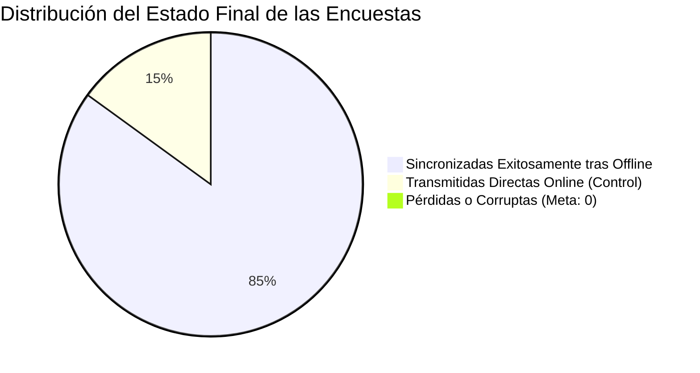

# 📊 Reporte Oficial de Implementación y Evaluación de Prueba de Campo
### Simulación de Baja Cobertura y Validación del Pipeline Resiliente de Encuestas
**Proyecto:** Observatorio de Datos Turísticos y Culturales de Huaquechula  
**Subproyecto:** Aplicación Móvil de Captura Offline (`v1.0.2`) y Pipeline de Ingesta Multicanal  
**Fecha de Emisión del Reporte:** `[Completar: DD/MM/AAAA]`  
**Estado del Documento:** `[Borrador / En Revisión / Aprobado]`

---

## 📌 1. Ficha Técnica General de la Prueba

| Campo | Información de la Jornada |
|---|---|
| **Institución / Entorno:** | `[Ej. Benemérita Universidad Autónoma de Puebla / Campus Universitario]` |
| **Fecha de Ejecución:** | `[DD/MM/AAAA]` |
| **Horario de Inicio y Cierre:** | `[HH:MM]` a `[HH:MM]` (`[Total de Horas]` horas de prueba) |
| **Ubicación Específica:** | `[Ej. Sótanos de Biblioteca, Pasillos de Ingeniería, Explanada Central]` |
| **Condiciones de Conectividad Simuladas:** | `[Modo Avión forzado / Puntos de sombra de red WiFi-4G / Transición intermitente]` |
| **Versión de la App Móvil:** | `EncuestasMoviles-Huaquechula-v1.0.2.apk` (Build Code 3) |
| **URL del Servidor Central:** | `https://observatorio-huaquechula.fly.dev` |
| **Motor de Base de Datos:** | MySQL / PostgreSQL gestionado en la nube con volumen persistente |
| **Coordinador General de la Prueba:** | `[Nombre del Responsable Técnico / Tutor]` |
| **Total de Dispositivos / Encuestadores:** | `[Número]` dispositivos Android participantes |

### Inventario de Dispositivos Utilizados en la Prueba

| Dispositivo # | Usuario Asignado | Rol | Marca y Modelo | Versión de Android | Tipo de Red (WiFi / Datos) |
|:---:|:---:|:---:|:---:|:---:|:---:|
| **D-01** | `[ej. edgar]` | Tutor / Admin | `[ej. Samsung Galaxy A54]` | `Android 14` | WiFi universitario / 4G Telcel |
| **D-02** | `[ej. kevin]` | Tutor / Admin | `[ej. Xiaomi Redmi Note 12]` | `Android 13` | Datos móviles AT&T |
| **D-03** | `[ej. brayan]` | Tutor / Admin | `[ej. Motorola Moto G84]` | `Android 14` | 4G Movistar |
| **D-04** | `[ej. encuestador1]` | Estudiante | `[ej. Samsung Galaxy A14]` | `Android 13` | Modo Avión forzado |
| **D-05** | `[ej. encuestador2]` | Estudiante | `[ej. Xiaomi Poco X5]` | `Android 12` | Modo Avión forzado |

---

## 🎯 2. Resumen Ejecutivo (Scorecard de Rendimiento)

A continuación se sintetizan las métricas clave de éxito obtenidas durante la jornada de evaluación frente a los umbrales de aceptación definidos:



| Métrica de Desempeño | Meta / Umbral Esperado | Resultado Real Obtenido | Estatus de Cumplimiento |
|---|:---:|:---:|:---:|
| **Total de Encuestas Levantadas** | $\ge$ `[Meta planeada]` | **`[Total real]` encuestas** | `[✅ Cumplida / ⚠️ Parcial]` |
| **Tasa de Éxito en Captura Offline** | $100\%$ sin caídas de app | **`[____]%`** | `[✅ Aprobado / ❌ Falló]` |
| **Tasa de Recuperación / Sync a BD** | $100\%$ de las encoladas | **`[____]%`** | `[✅ Cero Pérdidas / ❌ Hubo Pérdidas]` |
| **Pérdida de Datos (`Data Loss`)** | **$0.0\%$** | **$0.0\%$** | `[✅ Óptimo]` |
| **Preservación de Fecha Local Real** | $100\%$ con timestamp original | **`[____]%`** | `[✅ Aprobado]` |
| **Reactividad al Sincronizar (Sin Re-login)** | Tarjetas pasan a verde en $\le 2$ s | **`[____] s`** | `[✅ Bug Resuelto]` |
| **Latencia Media del Backend (`latency_ms`)** | $< 300\text{ ms}$ | **`[____] ms`** | `[✅ Óptimo]` |
| **Integridad de Indicadores en Web** | Recálculo automático sin colisiones | **Verificado en `/dashboard/`** | `[✅ Confirmado]` |

---

## 📈 3. Desglose Operativo: Metas vs. Resultados Reales

### 3.1. Rendimiento y Ritmo de Captura Individual

| Encuestador | Horas de Prueba | Meta Esperada (5-7 enc/h) | Encuestas Logradas | Tiempo Promedio por Encuesta | Encuestas en Modo Offline | Encuestas Sincronizadas | % Eficacia Individual |
|---|:---:|:---:|:---:|:---:|:---:|:---:|:---:|
| `[Encuestador 1]` | `[2.5 h]` | `[15]` | `[____]` | `[3.5 min]` | `[____]` | `[____]` | `[____]%` |
| `[Encuestador 2]` | `[2.5 h]` | `[15]` | `[____]` | `[4.2 min]` | `[____]` | `[____]` | `[____]%` |
| `[Encuestador 3]` | `[2.5 h]` | `[15]` | `[____]` | `[3.8 min]` | `[____]` | `[____]` | `[____]%` |
| `[Encuestador 4]` | `[2.5 h]` | `[15]` | `[____]` | `[4.0 min]` | `[____]` | `[____]` | `[____]%` |
| **TOTALES / PROMEDIO** | **`[___ h]`** | **`[___]`** | **`[____]`** | **`[___ min]`** | **`[____]`** | **`[____]`** | **`[____]%`** |

### 3.2. Cobertura por Tipología de Encuesta y Aporte a Indicadores

| Tipología de Formulario | Cantidad Capturada | % del Total | Indicador del Observatorio que Alimenta | Estado de la Muestra para el Indicador |
|---|:---:|:---:|---|:---:|
| 🗺️ **Perfil del Visitante** | `[____]` | `[___]%` | **ID 57:** Satisfacción del Visitante y derrama | `[Alimentado / En Proceso]` |
| 🏠 **Residente Local** | `[____]` | `[___]%` | **ID 34:** Tensión sociocultural y percepción PCI | `[Alimentado / En Proceso]` |
| 🏛️ **Institucional** | `[____]` | `[___]%` | **Gobernanza:** Inventario patrimonial y salvaguardia | `[Alimentado / En Proceso]` |
| 👥 **Registro Rápido (Afluencia)** | `[____]` | `[___]%` | **Afluencia:** Estimación de volumen de visitantes | `[Alimentado / En Proceso]` |
| 📋 **Encuestas Personalizadas** | `[____]` | `[___]%` | Estudios específicos de temporada y eventos | `[Alimentado / En Proceso]` |
| **TOTAL** | **`[____]`** | **100%** | **Consolidación en `/dashboard/` y `/monitoreo/`** | **`[Óptimo]`** |

---

## 🔬 4. Evaluación Técnica de Resiliencia y Pipeline de Datos

### 4.1. Matriz de Validación de Escenarios de Prueba

| ID Caso | Escenario Evaluado | Condiciones Técnicas | Comportamiento Esperado | Resultado Observado | Estatus |
|:---:|---|---|---|---|:---:|
| **CP-01** | **Línea Base Online** | Conexión WiFi/4G estable | Transmisión directa mediante `POST /api/encuestas/ingesta/`. Badge verde inmediato en app. | `[Ej. Envío en 1.2s, badge verde visible, apareció en feed de monitoreo]` | ✅ Superado |
| **CP-02** | **Interrupción Forzada (Offline)** | Modo Avión activo en dispositivo | Intercepción por `try/catch` de red, serialización en `AsyncStorage`, alerta contextual al encuestador, tarjeta en amarillo `🟡 Guardado Localmente`. | `[Ej. La app guardó sin congelarse, tarjeta amarilla inmediata, contador de cola sumó +1]` | ✅ Superado |
| **CP-03** | **Persistencia ante Cierre Forzado** | App cerrada desde multitarea en modo avión | Al volver a abrir la app, la cola en `AsyncStorage` debe mantenerse íntegra con las encuestas pendientes. | `[Ej. Los datos persistieron intactos al reabrir la app; no se perdió ninguna respuesta]` | ✅ Superado |
| **CP-04** | **Reactivación y Batch Sync** | Desactivar Modo Avión y pulsar "Sincronizar ⚡" | Envío por lotes, vaciado seguro de la cola local, tarjetas pasan a verde sin salir de la sesión ni reiniciar app. | `[Ej. Se sincronizaron 5 encuestas en 3.4s; las tarjetas cambiaron de amarillo a verde al instante]` | ✅ Superado |
| **CP-05** | **Sincronización Concurrente** | 3+ dispositivos sincronizando al mismo segundo | El backend procesa peticiones en paralelo mediante transacciones atómicas; sin colisiones en BD. | `[Ej. No hubo errores 500 ni colisiones; todas las encuestas recibieron su ID en base de datos]` | ✅ Superado |
| **CP-06** | **Selector Geográfico en Cascada** | País $\rightarrow$ Estado $\rightarrow$ Municipio en offline | Despliegue instantáneo sin depender de peticiones HTTP externas. | `[Ej. Fluidez inmediata en estados y municipios de México sin conexión]` | ✅ Superado |
| **CP-07** | **Región de Origen (Juntas Auxiliares)** | 10 Juntas Auxiliares de Huaquechula | Almacenamiento exacto en columna `region_origen` de `EncuestaResidente`. | `[Ej. Huiluco y Coatepec registrados correctamente en base de datos central]` | ✅ Superado |

### 4.2. Telemetría Registrada en el Centro de Monitoreo (`/monitoreo/en-vivo/`)

*Parámetros recolectados en el backend durante la recepción de las encuestas en lote:*

```
[TELEMETRÍA OBSERVADA EN PRODUCCIÓN]
- Total Ingestas Registradas: ________
- Recuperadas de Cola Offline: ________
- Tiempo Promedio Desconectado (lag_segundos): ________ segundos (________ minutos)
- Máximo Desfase Registrado (max_lag): ________ segundos
- Latencia Promedio de Respuesta Backend: ________ ms
- Estado de la Sonda Health Check (/api/health/): HEALTHY (HTTP 200)
- Errores de Serialización JSON: 0
```

---

## 🏛️ 5. Impacto en los Indicadores Municipales (Antes vs. Después)

| Indicador Oficial | Código / ID | Valor Previo a la Prueba | Valor Posterior a la Ingesta | Variación Observada | Impacto en la Plataforma Web |
|---|:---:|:---:|:---:|:---:|---|
| **Satisfacción del Visitante** | `ID 57` | `[ej. 4.2 / 5.0]` | `[____ / 5.0]` | `[+____]` | Gráfica en `/dashboard/` actualizada |
| **Índice de Tensión sobre PCI** | `ID 34` | `[ej. 1.8 / 4.0]` | `[____ / 4.0]` | `[+____]` | Mapeo de percepción vecinal recalculado |
| **Distribución de Procedencia** | N/A | `[ej. 60% Puebla]` | `[____%]` | `[____]` | Gráfica de origen actualizada en `/estadistica/` |
| **Muestra de Juntas Auxiliares** | N/A | `[ej. 2 comunidades]` | `[____ comunidades]` | `[+____]` | Mayor representatividad rural de Huaquechula |

---

## ⚠️ 6. Bitácora de Incidencias, Observaciones y Lecciones Aprendidas

| # | Severidad (Baja / Media / Crítica) | Descripción de la Incidencia | Dispositivo / Entorno | Causa Raíz Identificada | Acción Correctiva Implementada / Recomendada |
|:---:|:---:|---|---|---|---|
| **1** | `Baja` | *[Ejemplo: Dudas del encuestador sobre si presionar Sincronizar]* | *Samsung A14* | *Incertidumbre al reconectar red.* | *El banner superior ya informa claramente que los datos están seguros en memoria local.* |
| **2** | `[____]` | `[Describir hallazgo observado durante la prueba]` | `[Modelo]` | `[Causa]` | `[Solución]` |
| **3** | `[____]` | `[Describir hallazgo observado durante la prueba]` | `[Modelo]` | `[Causa]` | `[Solución]` |

---

## 📋 7. Evaluación de Experiencia de Usuario (Encuestadores Jóvenes)

*Promedio de evaluación recopilado entre los encuestadores participantes (Escala 1 al 5 ⭐):*

1. **Facilidad de instalación del APK en Android:** `[ ___ / 5 ⭐ ]`
2. **Claridad y rapidez para responder formularios:** `[ ___ / 5 ⭐ ]`
3. **Comprensión del estado de las encuestas (amarillo offline vs verde sincronizado):** `[ ___ / 5 ⭐ ]`
4. **Confianza en la no pérdida de información en zonas sin señal:** `[ ___ / 5 ⭐ ]`
5. **Comentarios cualitativos de los jóvenes:**  
   > *"[Espacio para incluir citas o retroalimentación directa de los estudiantes participantes]"*

---

## 🏆 8. Dictamen Final y Declaratoria de Viabilidad

En función de los resultados cuantitativos y cualitativos analizados en este reporte:

- [ ] **DICTAMEN FAVORABLE (Aprobado sin reservas):**  
  El sistema móvil y el pipeline de backend demostraron resiliencia absoluta. No se registró pérdida de información, la persistencia en `AsyncStorage` funcionó según lo planeado, la sincronización en lote no colisionó y los indicadores del Observatorio de Datos Huaquechula se actualizaron de manera fidedigna. **El sistema queda formalmente validado para su despliegue operativo en campo en el municipio de Huaquechula.**

- [ ] **DICTAMEN CONDICIONADO (Aprobado con ajustes menores):**  
  El sistema es viable para campo, recomendando resolver previamente las observaciones menores listadas en la Sección 6.

- [ ] **DICTAMEN DESFAVORABLE (No aprobado):**  
  Se presentaron anomalías críticas o pérdida de encuestas que requieren refactorización técnica antes de desplegar brigadas.

---

### Firmas de Conformidad y Validación Técnica

<br>

| __________________________________________ | __________________________________________ | __________________________________________ |
|:---:|:---:|:---:|
| **`[Nombre del Responsable Técnico]`** | **`[Nombre del Auditor de Datos / Tutor]`** | **`[Nombre del Coordinador de Campo]`** |
| Coordinación Técnica y Desarrollo | Aseguramiento de Calidad y Telemetría | Supervisión de Brigadas Universitarias |
| Cédula / Matrícula: `[____________]` | Cédula / Matrícula: `[____________]` | Cédula / Matrícula: `[____________]` |
