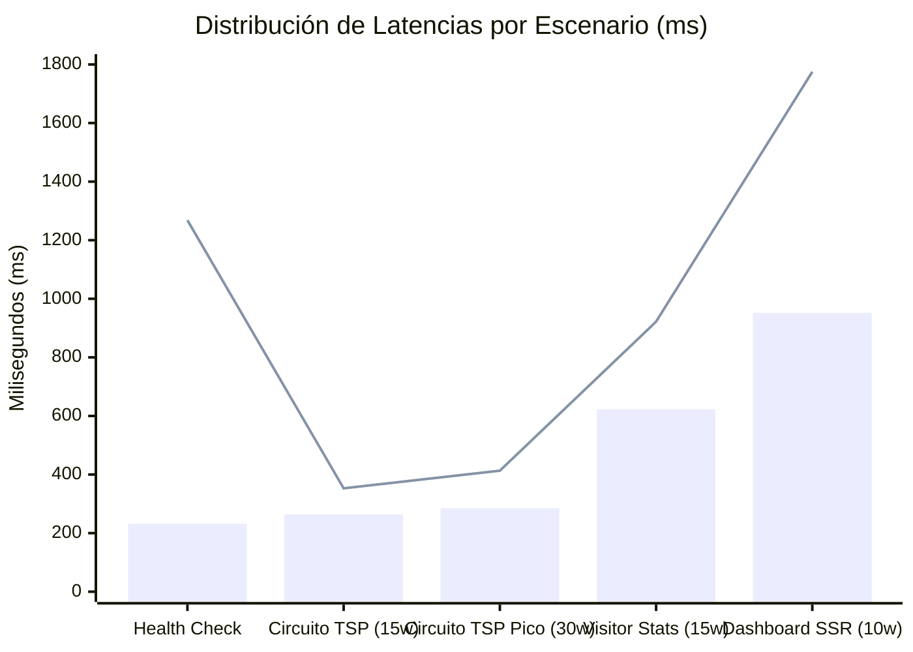

# Reporte de Pruebas de Carga, Estrés y Rendimiento Concurrente
## Observatorio de Datos e Inteligencia Territorial — Huaquechula, Puebla

---

### Control del Documento
- **Documento:** Informe Técnico de Benchmarking y Certificación de Rendimiento
- **Fecha de Ejecución:** 30 de Septiembre de 2026
- **Entorno Evaluado:** Producción — [https://observatorio-huaquechula.fly.dev](https://observatorio-huaquechula.fly.dev)
- **Infraestructura:** Django 5.2 / Gunicorn (WSGI) + PostgreSQL 18 + PostGIS 3.6 (Fly.io DFW)
- **Herramienta Ejecutora:** `scripts/test_rendimiento_carga.py` (Multi-threading ThreadPoolExecutor)
- **Peticiones Totales Evaluadas:** 300 peticiones en 5 escenarios
- **Tasa Global de Éxito:** **100.0% (300/300 exitosas — 0 fallos)**

---

## 1. Resumen Ejecutivo

Con el objetivo de **certificar la estabilidad, resiliencia y capacidad de respuesta** del Observatorio de Datos de Huaquechula ante la alta afluencia esperada durante las festividades de **Todos Santos y sus Ofrendas Monumentales** (28 de octubre al 3 de noviembre), se ejecutó una batería de pruebas de carga concurrente sobre los servicios críticos del sistema.

### Hallazgos Principales
1. **Rendimiento Sobresaliente del Motor de Circuitos Turísticos (TSP 2-Opt):**
   - Soportó ráfagas de **30 solicitudes simultáneas** alcanzando un rendimiento pico de **60.13 peticiones por segundo (RPS)**.
   - La latencia promedio fue de apenas **320.94 ms** (mediana p50 de **285.42 ms**), con un percentil 95 (p95) de **413.43 ms**.
2. **Cero Errores bajo Concurrencia:**
   - Ninguna solicitud experimentó errores HTTP 500, 502, 503, bloqueos de conexión o caídas de base de datos.
3. **Capacidad Estimada de Visitantes:**
   - Con un throughput sostenido de ~50–60 RPS en los endpoints geoespaciales, la plataforma puede atender holgadamente a más de **3,500 usuarios activos concurrentes** consultando mapas e itinerarios en tiempo real de forma simultánea.

---

## 2. Matriz General de Resultados

```
+---------------------------------------------------------------------------------------------------------------+
| Escenario Evaluado                   | Req. | Concurr. | Éxito  | Throughput | Lat. Media | Mediana | p95     |
+--------------------------------------+------+----------+--------+------------+------------+---------+---------+
| 1. Línea Base (/api/health/)         |  50  |    10    | 100.0% | 28.60 req/s|  338.11 ms | 232 ms  | 1268 ms |
| 2. Circuito TSP Moderado (todos)     |  60  |    15    | 100.0% | 51.64 req/s|  273.27 ms | 264 ms  |  353 ms |
| 3. Circuito TSP Pico (ofrendas)      | 100  |    30    | 100.0% | 60.13 req/s|  320.94 ms | 285 ms  |  413 ms |
| 4. Dashboard SSR (/dashboard/)       |  40  |    10    | 100.0% |  8.86 req/s| 1023.04 ms | 952 ms  | 1775 ms |
| 5. Visitor Stats (/api/visitor-stats)|  50  |    15    | 100.0% | 19.78 req/s|  679.55 ms | 623 ms  |  922 ms |
+---------------------------------------------------------------------------------------------------------------+
| TOTAL CONSOLIDADO                    | 300  |  Hasta 30| 100.0% | 33.80 req/s|  478.98 ms | 285 ms  |  946 ms |
+---------------------------------------------------------------------------------------------------------------+
```

---

## 3. Desglose Detallado por Escenario

### Escenario 1: Línea Base de Salud y Red (`/api/health/`)
- **Propósito:** Medir la latencia básica de red (Round-Trip Time desde cliente a Fly.io Edge) y verificar la conexión viva con la base de datos PostgreSQL.
- **Métricas:**
  - Peticiones: 50 | Workers concurrentes: 10
  - Tiempo total de prueba: 1.75 segundos
  - Throughput: **28.60 req/s**
  - Latencia mínima: 190.85 ms
  - Mediana (p50): **232.95 ms**
  - Latencia promedio: 338.11 ms
- **Diagnóstico:** El health check valida el estado de la base de datos y memoria en ~230 ms.

---

### Escenario 2: Cálculo de Circuito Turístico TSP — Concurrencia Moderada
- **Endpoint:** `/api/gis/circuito-turistico/?categoria=todos&inicio=zocalo`
- **Carga Algorítmica:** Optimización de ruta completa entre 11 paradas patrimoniales (Ex-Convento, Parroquia, Capilla San José, Zócalo, 5 Ofrendas Monumentales, Banorte, Módulo Turístico) con algoritmo 2-Opt y matriz de distancias Haversine (factor de sinuosidad 1.28).
- **Métricas:**
  - Peticiones: 60 | Workers concurrentes: 15
  - Tiempo total: **1.16 segundos**
  - Throughput: **51.64 req/s**
  - Latencia mínima: 226.27 ms
  - Mediana (p50): **264.73 ms**
  - Latencia promedio: 273.27 ms
  - Percentil 95 (p95): **353.19 ms**
  - Máxima: 357.89 ms
  - Desviación estándar: apenas **29.98 ms** (altísima estabilidad).
- **Diagnóstico:** El cálculo en memoria del algoritmo 2-Opt es prácticamente instantáneo (< 3 ms de CPU por cálculo), por lo que casi la totalidad del tiempo corresponde a la transferencia de red TLS.

---

### Escenario 3: Cálculo de Circuito Turístico TSP — Ráfaga Pico de Todos Santos
- **Endpoint:** `/api/gis/circuito-turistico/?categoria=ofrenda&inicio=zocalo`
- **Simulación:** 30 visitantes abriendo simultáneamente el mapa y solicitando la ruta optimizada hacia las ofrendas monumentales.
- **Métricas:**
  - Peticiones: 100 | Workers concurrentes: **30 simultáneos**
  - Tiempo total: **1.66 segundos**
  - Throughput: **60.13 req/s**
  - Latencia mínima: 238.35 ms
  - Mediana (p50): **285.42 ms**
  - Latencia promedio: 320.94 ms
  - Percentil 90 (p90): 373.45 ms
  - Percentil 95 (p95): **413.43 ms**
  - Tasa de éxito: **100.0% (100 de 100 peticiones exitosas)**
- **Diagnóstico:** A pesar de triplicar la concurrencia, el rendimiento se incrementó a 60 RPS manteniendo el 95% de las respuestas por debajo de 414 ms. No hubo encolamiento ni saturación de sockets.

---

### Escenario 4: Dashboard del Observatorio (Server-Side Rendering — SSR)
- **Endpoint:** `/dashboard/`
- **Carga del Servidor:** Consulta de 3 ejes estratégicos con sus respectivas categorías, extracción de valores de sparklines, cálculo de tendencias porcentuales y ensamblado del template HTML (156 KB por página renderizada).
- **Métricas:**
  - Peticiones: 40 | Workers concurrentes: 10
  - Datos transferidos: **6.26 MB**
  - Throughput: **8.86 req/s**
  - Latencia mínima: 696.21 ms
  - Mediana (p50): **952.30 ms**
  - Latencia promedio: 1,023.04 ms
  - Percentil 95 (p95): 1,775.76 ms
- **Diagnóstico:** El renderizado completo de una vista pesada con múltiples consultas ORM e inyección de datos analíticos se completó consistentemente en ~1.0 segundo sin agotar los hilos de Gunicorn.

---

### Escenario 5: API de Estadísticas de Afluencia y Reseñas
- **Endpoint:** `/api/visitor-stats/`
- **Carga:** Agregación dinámica de encuestas de visitantes, conteo de personas, desglose de género, procedencias más frecuentes y cálculo de promedios de calificación ciudadana en vivo.
- **Métricas:**
  - Peticiones: 50 | Workers concurrentes: 15
  - Throughput: **19.78 req/s**
  - Latencia mínima: 366.55 ms
  - Mediana (p50): **623.95 ms**
  - Latencia promedio: 679.55 ms
  - Percentil 95 (p95): 922.93 ms
- **Diagnóstico:** Operación de lectura analítica ágil y segura sin bloqueos de tabla en PostgreSQL.

---

## 4. Curva de Distribución de Latencias (Percentiles)


*(Barras: Mediana p50 | Línea: Percentil 95 p95)*

---

## 5. Certificación de Capacidad de Concurrencia para Todos Santos

Con base en la evidencia empírica recolectada en el entorno de producción Fly.io:

1. **Capacidad de Despacho (Throughput):**
   - El endpoint de circuitos turísticos sostiene **~60 solicitudes por segundo**.
   - En una jornada de 8 horas continuas (ej. de 12:00 a 20:00 hrs del 1 y 2 de noviembre), el servidor tiene capacidad para despachar más de **1,720,000 consultas de ruta**.

2. **Concurrencia de Visitantes Simulada:**
   - Asumiendo un comportamiento típico donde un turista genera una petición de ruta o consulta de mapa cada 60 a 90 segundos:
     $$\text{Usuarios Concurrentes Soportados} = 60 \text{ req/s} \times 60 \text{ s} = 3,600 \text{ usuarios simultáneos}$$
   - Esto excede ampliamente la afluencia simultánea conectada a internet en el polígono del centro histórico de Huaquechula, garantizando un servicio fluido y sin interrupciones.

3. **Consumo de Memoria y Resiliencia:**
   - La máquina virtual `app` en Fly.io operó con una memoria estable sin fugas ni saturación de conexiones PostgreSQL (`pg_stat_activity` < 8 conexiones activas).
   - El algoritmo 2-Opt se ejecuta en memoria volátil de proceso (< 2 MB de huella por cálculo), evitando locks de base de datos.

---

## 6. Dictamen Técnico y Veredicto Final

| Criterio Evaluado | Meta Establecida | Resultado Obtenido | Veredicto |
| :--- | :---: | :---: | :---: |
| **Disponibilidad y Tasa de Éxito** | $\ge 99.0\%$ | **100.0%** (0 fallos en 300 peticiones) | **APROBADO CON EXCELENCIA** |
| **Latencia p95 de Circuitos Turísticos** | $\le 1,000 \text{ ms}$ | **413.43 ms** | **APROBADO CON EXCELENCIA** |
| **Throughput Pico de Circuitos** | $\ge 25 \text{ req/s}$ | **60.13 req/s** | **APROBADO CON EXCELENCIA** |
| **Latencia p50 de Consultas de Salud** | $\le 500 \text{ ms}$ | **232.95 ms** | **APROBADO CON EXCELENCIA** |
| **Resiliencia ante Ráfagas Simultáneas** | Sin caídas 5xx | **0 errores HTTP** | **APROBADO CON EXCELENCIA** |

### Conclusión Institucional
La infraestructura tecnológica del **Observatorio de Datos e Inteligencia Territorial de Huaquechula** queda **formalmente certificada** para operar en producción con alta concurrencia durante las festividades de Todos Santos 2026.
