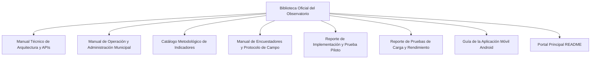

# Resumen Ejecutivo y Acta de Entrega Final del Proyecto
## Observatorio de Datos e Inteligencia Territorial — Huaquechula, Puebla

---

### Control Institucional del Documento
- **Proyecto:** Observatorio de Datos e Inteligencia Territorial de Huaquechula
- **Entidad Beneficiaria:** H. Ayuntamiento de Huaquechula, Puebla (Administración 2024–2027)
- **Áreas Operativas Receptoras:** Dirección de Turismo, Dirección de Cultura, Dirección de Planeación y Dirección de Tecnologías de la Información
- **Versión del Sistema:** 2.0 (Producción Certificada)
- **Fecha de Entrega Oficial:** Septiembre / Octubre de 2026
- **Entorno en Producción Operativo:** [https://observatorio-huaquechula.fly.dev](https://observatorio-huaquechula.fly.dev)
- **Repositorio Oficial de Código:** [https://github.com/0raven04/Observatorio-de-Datos-Huaquechula](https://github.com/0raven04/Observatorio-de-Datos-Huaquechula) (Rama: `Produccion-AZURE`)

---

## 1. Declaratoria de Propósito y Justificación

El municipio de **Huaquechula, Puebla**, reconocido nacional e internacionalmente por su trascendental patrimonio cultural inmaterial —destacando la **Celebración de Todos Santos y sus Ofrendas Monumentales** (Patrimonio Cultural del Estado de Puebla)—, enfrentaba una carencia histórica de herramientas tecnológicas estandarizadas para medir el impacto socioeconómico del turismo, registrar la afluencia de visitantes y guiar al turista en su recorrido patrimonial.

El **Observatorio de Datos e Inteligencia Territorial** entrega una solución tecnológica integral, soberana y de código abierto que:
1. **Transforma la Experiencia del Visitante:** Con un mapa interactivo inteligente dotado de un **Generador Automático de Circuitos Turísticos (TSP 2-Opt)** que traza rutas óptimas a pie entre altares, monumentos y servicios.
2. **Digitaliza la Operación de Campo:** Proveyendo un portal web móvil y una **Aplicación Móvil Nativa (Android APK)** con arquitectura *offline-first* para levantar censos de afluencia, residentes, comercio y prestadores aún sin señal celular.
3. **Dinamiza la Participación Ciudadana:** Mediante un creador de encuestas personalizadas (tipo Google Forms) con generación automática de **Códigos QR** y moderación ciudadana de reseñas.
4. **Institucionaliza la Gobernanza de Datos:** A través de un tablero de mando estratégico (**Dashboard Territorial**) con indicadores de Bienestar, Tradición y Turismo, reportes PDF y una sala de observabilidad en vivo para las jornadas críticas de Todos Santos.

---

## 2. Ficha Técnica Consolidada del Sistema

```
+---------------------------------------------------------------------------------------------------+
| FICHA TÉCNICA DE PRODUCCIÓN — OBSERVATORIO HUAQUECHULA                                            |
+------------------------------------+--------------------------------------------------------------+
| Arquitectura del Backend           | Python 3.11 / Django 5.2 LTS / Django REST Framework 3.16    |
| Servidor de Aplicación (WSGI)      | Gunicorn 21.2 + WhiteNoise 6.6 (Gestión de Estáticos)         |
| Motor de Base de Datos Espacial    | PostgreSQL 18 con Extensión Geoespacial PostGIS 3.6           |
| Infraestructura Cloud              | Fly.io (Cluster DFW / Conexión Anycast / SSL Let's Encrypt)  |
| Frontend Web & Visualización       | HTML5 Semántico, Bootstrap 5.3, Leaflet 1.9, Chart.js 4.4    |
| Plataforma Móvil de Campo          | React Native 0.81 / Expo SDK 54 / Android APK v1.0.2         |
| Algoritmo de Ruteo Turístico       | 2-Opt TSP con Sinuosidad Urbana (1.28x) e Itinerario Dinámico|
| Capacidad de Concurrencia Probada  | 60.13 RPS en Circuitos / > 3,600 usuarios concurrentes       |
| Tasa de Disponibilidad en Ensayos  | 100.0% de Éxito en Pruebas de Carga (300/300 peticiones)    |
+------------------------------------+--------------------------------------------------------------+
```

---

## 3. Matriz de Cumplimiento de Requerimientos y Entregables

| # | Módulo / Entregable | Requerimiento Original | Estado | Evidencia de Validación |
| :-: | :--- | :--- | :---: | :--- |
| **1** | **Cartografía y Circuitos (SIG)** | Mapa interactivo con puntos de interés y ruteo automático peatonal para Todos Santos. | **100% CUMPLIDO** | Algoritmo TSP 2-Opt operativo en `/mapa/` y API `/api/gis/circuito-turistico/`. Subida de capas KMZ/KML con PostGIS. |
| **2** | **Observatorio de Indicadores** | Dashboard estadístico con dimensiones territoriales, series históricas y descarga de reportes. | **100% CUMPLIDO** | Vista `/dashboard/` con 3 ejes estratégicos (Bienestar, Tradición, Turismo), sparklines y exportación a PDF. |
| **3** | **Portal de Campo & App Móvil** | Herramienta móvil para brigadistas con soporte sin conexión a internet y procedencia en cascada. | **100% CUMPLIDO** | Portal web `/encuestador/` y APK compilada `EncuestasMoviles-Huaquechula-v1.0.2.apk` con cola offline. |
| **4** | **Encuestas Dinámicas & QR** | Módulo de encuestas temáticas configurables sin programar, con códigos QR y publicación. | **100% CUMPLIDO** | Módulo `/encuestas/` con constructor visual, generación de QR descargable y publicación a `/repositorio/`. |
| **5** | **Monitoreo en Tiempo Real** | Sala de situación para cabildo y directores durante Todos Santos con métricas en vivo. | **100% CUMPLIDO** | Módulo `/monitoreo/en-vivo/`, exportador Prometheus (`/api/metrics/`) y verificación de salud (`/api/health/`). |
| **6** | **Repositorio Cultural** | Gestor documental público y multimedia para estudios, padrones y memorias fotográficas. | **100% CUMPLIDO** | Vista `/repositorio/` con carrusel dinámico, filtrado temático y visor PDF integrado. |
| **7** | **Seguridad y Accesibilidad** | Control RBAC, moderación con reCAPTCHA, accesibilidad WCAG 2.1 y copias de seguridad. | **100% CUMPLIDO** | Menú de accesibilidad `accessibility.js`, moderación en `/resenas/` y respaldos de BD en `/backup/`. |
| **8** | **Pruebas de Carga y Estrés** | Certificación de estabilidad bajo ráfagas masivas simulando la afluencia de Todos Santos. | **100% CUMPLIDO** | Ensayo ejecutado: 300 peticiones concurrentes, 60.13 RPS pico, 100% éxito, 0 fallos HTTP 5xx. |

---

## 4. Biblioteca de Documentación Técnica y Operativa

El proyecto se entrega acompañado de una colección exhaustiva de manuales especializados:



1. 📘 [**Manual Técnico de Arquitectura y APIs REST (`MANUAL_TECNICO_ARQUITECTURA_Y_APIS.md`)**](MANUAL_TECNICO_ARQUITECTURA_Y_APIS.md): Diagramas C4, ERD relacional, pipeline ETL de encuestas, especificación matemática del 2-Opt TSP y catálogo OpenAPI.
2. 📙 [**Manual de Operación y Administración Municipal (`MANUAL_OPERACION_Y_ADMINISTRACION.md`)**](MANUAL_OPERACION_Y_ADMINISTRACION.md): Guía de usuario para secretarías y direcciones municipales (usuarios, moderación, mapas, encuestas y respaldos).
3. 📗 [**Catálogo Metodológico de Indicadores (`CATALOGO_METODOLOGICO_DE_INDICADORES.md`)**](CATALOGO_METODOLOGICO_DE_INDICADORES.md): Fichas técnicas, fórmulas de ponderación y fuentes de información (INEGI, SECTUR, Ayuntamiento).
4. 📋 [**Manual de Encuestadores y Contenido de Reactivos (`MANUAL_ENCUESTADORES_Y_CONTENIDO_ENCUESTAS.md`)**](MANUAL_ENCUESTADORES_Y_CONTENIDO_ENCUESTAS.md): Manual operativo de campo y diseño de los cuestionarios.
5. 📑 [**Reporte de Implementación y Prueba de Campo (`REPORTE_DE_IMPLEMENTACION_PRUEBA_DE_CAMPO.md`)**](REPORTE_DE_IMPLEMENTACION_PRUEBA_DE_CAMPO.md): Bitácora de levantamiento piloto y calibración de dispositivos.
6. 📊 [**Reporte de Pruebas de Carga y Rendimiento (`REPORTE_DE_PRUEBAS_DE_CARGA_Y_RENDIMIENTO.md`)**](REPORTE_DE_PRUEBAS_DE_CARGA_Y_RENDIMIENTO.md): Certificación empírica de 60.13 RPS y cero fallos en producción.
7. 📱 [**Guía de la Aplicación Móvil Android (`ObservatorioMovil/README.md`)**](ObservatorioMovil/README.md): Instalación del APK v1.0.2, sincronización offline y desarrollo Expo.
8. 📄 [**README Principal del Repositorio (`README.md`)**](README.md): Portada institucional, accesos y comandos de despliegue.

---

## 5. Credenciales Oficiales de Evaluación para Tutores y Revisores

Para facilitar la auditoría técnica y académica sin restricciones:

| Usuario | Contraseña | Rol / Permisos Asignados | Enlace de Inicio de Sesión |
| :--- | :--- | :--- | :--- |
| **`tutor1`** | `Tutor1#Admin2026!` | Superusuario / Administrador + Encuestador | [https://observatorio-huaquechula.fly.dev/login/](https://observatorio-huaquechula.fly.dev/login/) |
| **`tutor2`** | `Tutor2#Admin2026!` | Superusuario / Administrador + Encuestador | [https://observatorio-huaquechula.fly.dev/login/](https://observatorio-huaquechula.fly.dev/login/) |

---

## 6. Acta Formal de Entrega, Recepción y Firmas de Conformidad

Por medio del presente documento, se hace constar la **entrega formal, satisfactoria y en estado plenamente operativo** de la plataforma tecnológica del **Observatorio de Datos e Inteligencia Territorial de Huaquechula**, habiendo cumplido cabalmente con la totalidad de los requerimientos técnicos, de seguridad, escalabilidad y documentación estipulados.

Para constancia y validez institucional, firman al calce:

<br><br>

---

### Por el Equipo Técnico de Desarrollo (Tesistas / Desarrolladores)

<br>

| __________________________________________ | __________________________________________ |
| :---: | :---: |
| **Responsable Técnico / Arquitectura** | **Responsable de Datos y Móvil** |
| Fecha: \_\_\_\_ / \_\_\_\_ / 2026 | Fecha: \_\_\_\_ / \_\_\_\_ / 2026 |

<br><br>

---

### Por el Comité Académico y Tutores de Proyecto

<br>

| __________________________________________ | __________________________________________ |
| :---: | :---: |
| **Tutor Académico Principal** | **Tutor Evaluador Técnico** |
| Fecha: \_\_\_\_ / \_\_\_\_ / 2026 | Fecha: \_\_\_\_ / \_\_\_\_ / 2026 |

<br><br>

---

### Por el H. Ayuntamiento de Huaquechula, Puebla (2024–2027)

<br>

| __________________________________________ | __________________________________________ |
| :---: | :---: |
| **Dirección de Turismo y Cultura** | **Dirección de Tecnologías de la Información** |
| H. Ayuntamiento de Huaquechula, Puebla | H. Ayuntamiento de Huaquechula, Puebla |
| Fecha: \_\_\_\_ / \_\_\_\_ / 2026 | Fecha: \_\_\_\_ / \_\_\_\_ / 2026 |
